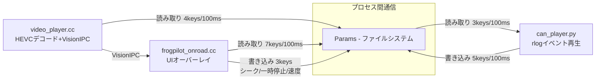
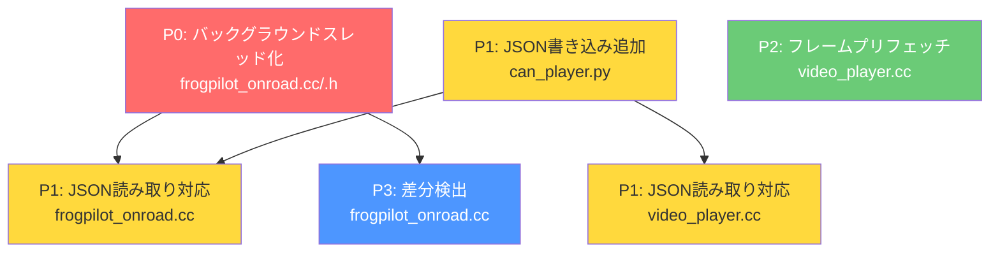
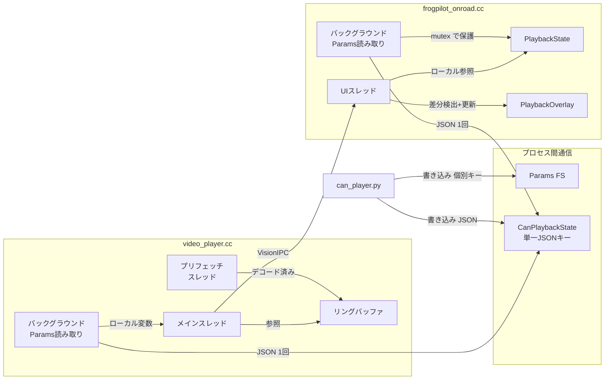

# CAN Playback リファクタリング方針

## 1. 現状の問題分析

### 1.1 アーキテクチャ概要

現在のCAN Playbackは3プロセス構成で、Params（ファイルシステム）を IPC として使用している。



### 1.2 Params I/Oの定量分析

| プロセス | 読み取り頻度 | 読み取りKeys/回 | 書き込みKeys/回 | 合計I/O/秒 |
|---|---|---|---|---|
| `frogpilot_onroad.cc` | 100ms | 7 | 0 | 70 reads/s |
| `video_player.cc` | 100ms | 4 | 0 | 40 reads/s |
| `can_player.py` | 100ms | 3 | 5 | 30 reads + 50 writes/s |
| **合計** | | | | **190 IOPS** |

### 1.3 ボトルネックの特定

1. **UIスレッドでのファイルI/O**（最重大）
   - `updatePlaybackPosition()` がQTimerでUIスレッド上で100ms間隔で実行
   - 1回の呼び出しで7回の `params.get()` = 7回のファイル読み出し
   - ファイルシステムアクセスは数ms〜数十msかかる可能性あり
   - UIスレッドをブロック → FPS低下・カクつきの直接原因

2. **video_playerの同期デコード**
   - `reader->get()` が同期的にHEVCデコードを実行
   - デコード中はメインスレッドがブロック
   - 事前デコード・キャッシュなし → 各フレームをその都度デコード
   - 倍速時にフレームスキップの計算はあるが、デコードが追いつかない

3. **重複するParams読み取り**
   - Position/Playing/Speedを `frogpilot_onroad.cc` と `video_player.cc` が独立に読み取り
   - 同じデータを2プロセスが個別にファイルシステムから取得

---

## 2. リファクタリング方針

### 優先順位と効果

| 優先度 | 変更内容 | 対象ファイル | 期待効果 |
|---|---|---|---|
| P0 | UIスレッドのParams読み取りをバックグラウンドスレッドへ移行 | `frogpilot_onroad.cc/.h` | UIカクつきの根本解決 |
| P1 | Params読み取りの集約 - 単一JSON化 | `can_player.py`, `frogpilot_onroad.cc`, `video_player.cc` | I/O削減 70→10 reads/s |
| P2 | video_playerのフレームプリフェッチ | `video_player.cc` | デコード遅延の解消 |
| P3 | UI更新の差分検出 | `frogpilot_onroad.cc` | 不要なUI再描画の削減 |

---

## 3. 各変更の詳細

### 3.1 P0: UIスレッドのParams読み取りバックグラウンド化

**対象**: `frogpilot/ui/qt/onroad/frogpilot_onroad.cc`, `frogpilot_onroad.h`

**現状の問題**:
```
UIスレッド: [paint] → [Params読み取り 7回] → [paint] → [Params読み取り 7回] → ...
                  ↑ ファイルI/Oでブロック                        ↑ ブロック
```

**変更後のアーキテクチャ**:
```
UIスレッド:     [paint] → [ローカル変数から更新] → [paint] → [ローカル変数から更新] → ...
バックグラウンド:    [Params読み取り] → sleep → [Params読み取り] → sleep → ...
```

**具体的な変更手順**:

1. `frogpilot_onroad.h` にバックグラウンドスレッド用のメンバーを追加:
   - `std::thread params_thread_` - Params読み取り用スレッド
   - `std::atomic<bool> params_thread_running_{false}` - スレッド停止フラグ
   - `std::mutex state_mutex_` - 状態変数のミューテックス
   - キャッシュ済み状態用の構造体 `PlaybackState`

2. `frogpilot_onroad.cc` の変更:
   - `initPlaybackOverlay()` 内で `std::thread` を起動
   - バックグラウンドスレッドで100ms間隔でParamsを読み取り、`state_mutex_` で保護されたメンバー変数に格納
   - UIスレッド側は `QTimer` でローカル変数からオーバーレイを更新（ファイルI/Oなし）
   - `stopPlayback()` でスレッドを停止

3. `updatePlaybackPosition()` を2つに分割:
   - `readPlaybackParams()` - バックグラウンドスレッドで実行（Params読み取り）
   - `applyPlaybackState()` - UIスレッドで実行（ローカル変数からオーバーレイ更新）

**新しいPlaybackState構造体**:
```cpp
struct PlaybackState {
  double position = 0.0;
  double duration = 0.0;
  double speed = 1.0;
  bool playing = false;
  bool can_playback = false;
  int loading_progress = 0;
  QString real_time;
};
```

**注意点**:
- QtのGUI操作は必ずUIスレッドで行うこと（シグナル/スロットまたは `QMetaObject::invokeMethod` を使用）
- `Params` オブジェクトはスレッドセーフではないため、バックグラウンドスレッド内で独自の `Params` インスタンスを使用
- スレッド起動・停止のライフサイクル管理に注意（デストラクタでの確実な停止）

---

### 3.2 P1: Params読み取りの集約 - 単一JSON化

**対象**: `frogpilot/can_log/can_player.py`, `frogpilot/ui/qt/onroad/frogpilot_onroad.cc`, `frogpilot/can_log/video_player.cc`

**現状の問題**:
- `can_player.py` が5つのキーに個別書き込み: `CanPlaybackPosition`, `CanPlaybackDuration`, `CanPlaybackSpeed`, `CanPlaybackPlaying`, `CanPlaybackRealTime`
- 読み取り側は5つのキーを個別に読み出し → 5回のファイルI/O

**変更方針**:
- 新しい単一キー `CanPlaybackState` を導入
- JSON形式で全状態を一括書き込み/読み取り
- 既存の個別キーは **読み取り専用として残す**（後方互換性）

**can_player.py の変更**:

`_update_params_state()` メソッドを変更し、JSON一括書き込みを追加:
```python
def _update_params_state(self) -> None:
    # 従来の個別書き込み（後方互換）は削除せず残す
    state_json = json.dumps({
        "position": position,
        "duration": self._duration,
        "speed": self.speed,
        "playing": not self._paused,
        "real_time": self._recording_time_str,
        "loading_progress": 100,  # ロード完了後は100
    })
    self.params.put("CanPlaybackState", state_json)
    # 個別キーも更新（video_playerの互換性のため残す）
    self.params.put("CanPlaybackPosition", str(position))
    ...
```

**frogpilot_onroad.cc の変更**:

バックグラウンドスレッドの読み取りを単一キーに変更:
```cpp
// 従来: 7回の params.get()
// 変更後: 1回の params.get() + JSON パース
std::string state_json = params.get("CanPlaybackState");
if (!state_json.empty()) {
    // QJsonDocument でパース
    // 1回のファイル読み取りで全状態を取得
}
```

**video_player.cc の変更**:

メインループのParams読み取りを単一キーに変更:
```cpp
// 従来: 4回の params.get() + params.getBool()
// 変更後: 1回の params.get() + JSON パース
```

**移行戦略**:
1. Phase 1: `can_player.py` が `CanPlaybackState` JSON の書き込みを追加（個別キーも維持）
2. Phase 2: `frogpilot_onroad.cc` と `video_player.cc` が `CanPlaybackState` から読み取り
3. Phase 3: 動作確認後、個別キーの書き込みを削除

**注意点**:
- JSON パースのオーバーヘッドはファイルI/O削減効果に比べて無視できる
- `CanPlaybackSeek`, `CanPlaybackPause`, `CanPlaybackSpeedCmd` などのコマンド系キーは個別のまま維持（低頻度のユーザーアクション）
- `CanPlaybackLoadingProgress` はローディング中のみ使用されるため個別維持

---

### 3.3 P2: video_playerのフレームプリフェッチ

**対象**: `frogpilot/can_log/video_player.cc`

**現状の問題**:
```
メインスレッド: [デコード frame N] → [送信] → [sleep] → [デコード frame N+1] → [送信] → ...
                      ↑ 数ms〜数十ms                  ↑ 数ms〜数十ms
```

**変更後のアーキテクチャ**:
```
プリフェッチスレッド: [デコード N] → [デコード N+1] → [デコード N+2] → ...
                            ↓              ↓              ↓
                      ┌───────── リングバッファ ─────────┐

メインスレッド:    [バッファから取得 N] → [送信] → [バッファから取得 N+1] → [送信] → ...
```

**具体的な変更手順**:

1. **プリフェッチバッファの定義**:
   - デコード済みフレームのリングバッファ（サイズ5〜10フレーム）
   - 各エントリ: `{int frame_idx, std::vector<uint8_t> nv12_data, bool valid}`

2. **プリフェッチスレッドの追加**:
   - 現在の再生位置から先読みしてフレームをデコード
   - `FrameReader::get()` を呼び出してNV12データを取得
   - デコード済みデータをリングバッファに格納
   - 倍速時はスキップすべきフレームをデコード対象から除外

3. **メインループの変更**:
   - `reader->get()` の直接呼び出しを、バッファからの取得に変更
   - バッファにフレームがある場合は即座にVisionIPCバッファにコピーして送信
   - バッファにない場合（シーク直後など）はフォールバックで同期デコード

4. **シーク時の処理**:
   - シークコマンド検出時にプリフェッチバッファをクリア
   - シーク先のフレームからプリフェッチを再開

**FrameReaderの制約への対処**:
- `FrameReader::get()` は `decode_mutex_` で保護されているため、プリフェッチスレッドからの呼び出しはスレッドセーフ
- ただし、1つの `FrameReader` インスタンスに対して複数スレッドからの同時アクセスは `decode_mutex_` で直列化される
- セグメントごとに独立した `FrameReader` があるため、セグメント境界をまたがない限り並列性は確保できる

**注意点**:
- NV12データのサイズは `width * height * 1.5`（例: 1164×874 = 約1.5MB/フレーム）
- 10フレームバッファで約15MB → C3Xのメモリで十分収容可能
- バッファサイズは `BUFFER_COUNT`（VisionIPC = 40）とは独立して管理
- `VisionBuf` を直接リングバッファに使うことはできない（VisionIPCの管理下にあるため）
- プリフェッチスレッドでは `std::vector<uint8_t>` にNV12データをコピーして保持

---

### 3.4 P3: UI更新の差分検出

**対象**: `frogpilot/ui/qt/onroad/frogpilot_onroad.cc`

**現状の問題**:
- 100msごとに必ずオーバーレイの `setPosition()`, `setPlaying()` 等を呼び出し
- 値が変わっていなくても `updateDisplay()` や `update()` が実行される
- Qtの `QWidget::update()` はダーティリージョンをマークするだけだが、頻繁な呼び出しは不要

**変更方針**:
- `applyPlaybackState()` 内で前回値と比較し、変更があった場合のみオーバーレイを更新
- `setPosition()` はスライダー位置が変わった場合のみ呼び出し
- `setPlaying()` は状態が変わった場合のみ呼び出し
- `setRealTime()` / `setPlaybackSpeed()` も同様

**実装イメージ**:
```cpp
void FrogPilotOnroadWindow::applyPlaybackState(const PlaybackState &state) {
    if (state.position != last_applied_.position) {
        playback_overlay_->setPosition(state.position);
    }
    if (state.playing != last_applied_.playing) {
        playback_overlay_->setPlaying(state.playing);
    }
    // ... 他のフィールドも同様
    last_applied_ = state;
}
```

---

## 4. 実装順序と依存関係



**推奨実装順序**:

1. **P0: バックグラウンドスレッド化** - UIカクつきの根本原因を解消
2. **P1: can_player.py の JSON 書き込み追加** - 個別キーも維持するため安全
3. **P1: frogpilot_onroad.cc の JSON 読み取り対応** - P0のバックグラウンドスレッド内で実装
4. **P1: video_player.cc の JSON 読み取り対応** - 独立して実装可能
5. **P2: フレームプリフェッチ** - P1完了後に実装
6. **P3: 差分検出** - P0完了後に実装可能、任何のタイミングでOK

---

## 5. 変更時の注意点

### 5.1 後方互換性

- **can_player.py**: 個別Paramsキーの書き込みを段階的に廃止する。最初はJSONと個別キーの両方に書き込む
- **video_player.cc**: JSON読み取りにフォールバック（JSONが空なら個別キー読み取り）を実装
- **コマンド系キー**: `CanPlaybackSeek`, `CanPlaybackPause`, `CanPlaybackSpeedCmd` は低頻度のため個別キーのまま維持

### 5.2 スレッドセーフティ

- `Params` クラスの `get()`/`put()` は個別にはスレッドセーフだが、複数キーの原子性は保証されない
- JSON化により、1回の `get()` で全状態を取得できるため、一貫性が向上
- `PlaybackState` 構造体の読み書きは `std::mutex` で保護
- Qtのシグナル/スロットはスレッド間通信に使用（`QMetaObject::invokeMethod` with `Qt::QueuedConnection`）

### 5.3 メモリ使用量

- フレームプリフェッチのリングバッファ: 10フレーム × 1.5MB = 約15MB
- JSON文字列: 数 hundred bytes（無視できる）
- C3Xデバイスの利用可能メモリに余裕があることを確認

### 5.4 デバイスでのテスト観点

- **通常再生（1.0x）**: FPS計測（リファクタリング前後の比較）
- **倍速再生（2.0x, 4.0x）**: フレームドロップなし、音声と映像の同期
- **シーク操作**: バッファクリアと再デコードの確認
- **一時停止/再開**: 即座の応答性
- **長時間再生**: メモリリークなし
- **ループ再生**: セグメント境界での正常な遷移

### 5.5 変更しないこと

- `common/params.h` の API（`get()`, `getBool()`, `put()` 等）
- Vision IPC のプロトコル
- `tools/replay/framereader.h` のインターフェース
- openpilot コアファイル（`selfdrive/`, `system/`, `tools/`）
- `playback_overlay.cc/.h` のインターフェース（`setPosition()` 等の公开APIは変更なし）

---

## 6. リファクタリング後のアーキテクチャ



### I/O削減効果

| プロセス | 変更前 | 変更後 | 削減率 |
|---|---|---|---|
| `frogpilot_onroad.cc` | 70 reads/s | 10 reads/s | 86%削減 |
| `video_player.cc` | 40 reads/s | 10 reads/s | 75%削減 |
| `can_player.py` | 30r + 50w/s | 30r + 60w/s | 書き込み+10 |
| **合計** | **190 IOPS** | **120 IOPS** | **37%削減** |

UIスレッドのファイルI/Oは **86%削減** され、残りの10 reads/sもバックグラウンドスレッドで実行されるため、UIスレッドは完全にファイルI/Oから解放される。