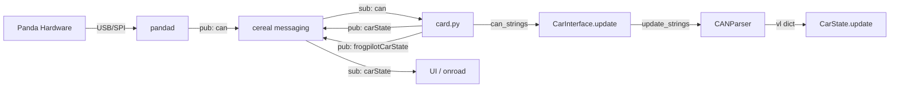
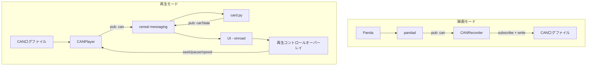
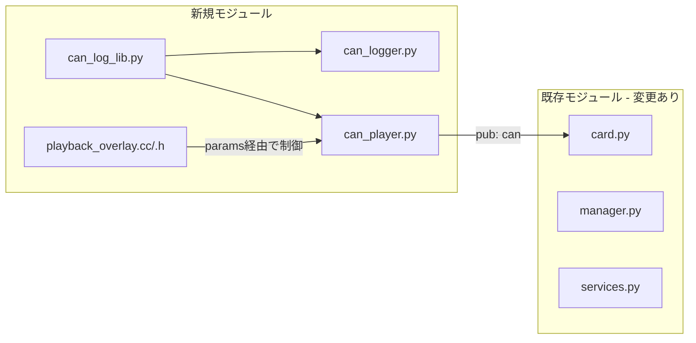
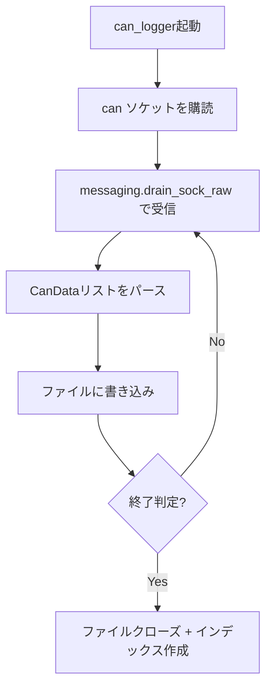
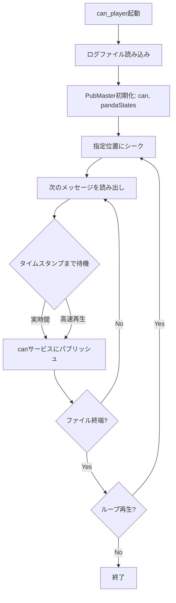
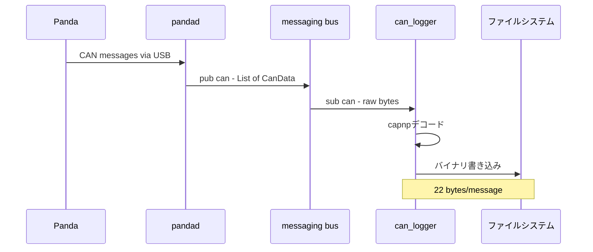
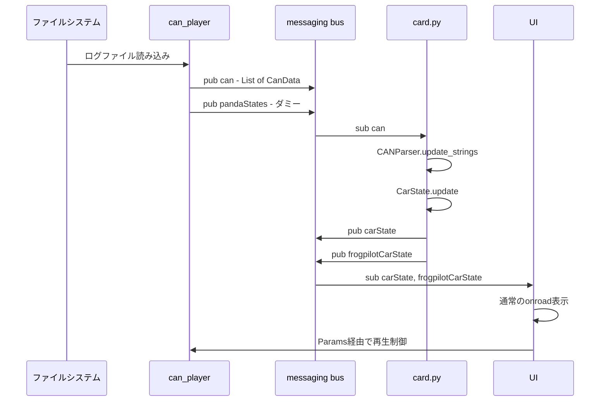

# CANBusログ管理・再生機能 アーキテクチャ設計

## 1. 調査結果サマリー

### 1.1 既存のCANデータフロー



### 1.2 主要な発見

| 項目 | 詳細 |
|------|------|
| CANメッセージフォーマット | `[address, busTime, data_bytes, src_bus]` タプル |
| CANシリアライズ | `can_list_to_can_capnp()` でcapnpの `List[CanData]` に変換 |
| CANParser入力 | `update_strings(can_strings)` が生バイト列リストを受け取る |
| card.pyのCAN取得 | `messaging.drain_sock_raw(self.can_sock)` でraw bytesを取得 |
| 既存REPLAY対応 | `REPLAY = "REPLAY" in os.environ` でログ時刻を使用 |
| UIのデータ取得 | C++ SubMasterで `carState`, `frogpilotCarState` を購読 |
| 参考実装 | `tools/sim/lib/simulated_car.py` が `can` サービスにパブリッシュ |

### 1.3 参考実装: SimulatedCar

[`SimulatedCar`](tools/sim/lib/simulated_car.py) は `can` メッセージングサービスに直接パブリッシュすることで、pandaハードウェアなしでCANデータを供給する実装。このパターンをそのまま流用できる。

```python
# tools/sim/lib/simulated_car.py より
self.pm = messaging.PubMaster(['can', 'pandaStates'])
msg = [self.packer.make_can_msg("ENGINE_DATA", 0, {"XMISSION_SPEED": speed})]
self.pm.send('can', can_list_to_can_capnp(msg))
```

---

## 2. システム構成図

### 2.1 全体アーキテクチャ



### 2.2 モジュール構成



---

## 3. 各モジュールの設計

### 3.1 CANログライブラリ: `frogpilot/can_log/can_log_lib.py`

CANログの読み書きを共通化するライブラリ。

#### ログフォーマット

バイナリフォーマット（高速・コンパクト）:

```
[ヘッダー]
  magic:        4 bytes  "CAND"
  version:      2 bytes  uint16
  header_size:  2 bytes  uint16
  num_messages: 4 bytes  uint32 (total count)
  duration_ns:  8 bytes  uint64 (total duration in nanoseconds)
  dbc_name:     64 bytes null-terminated string
  car_fingerprint: 64 bytes null-terminated string
  reserved:     80 bytes

[メッセージレコード] (繰り返し)
  timestamp_ns: 8 bytes  uint64 (ログ開始からの相対ナノ秒)
  address:      4 bytes  uint32
  bus:          1 byte   uint8
  dlc:          1 byte   uint8
  data:         8 bytes  (常に8バイト、未使用部分はゼロ埋め)
```

1メッセージあたり22バイト。100Hz×50メッセージ/フレーム = 5000メッセージ/秒 → 約110KB/秒 → 約6.6MB/分。

#### インターフェース

```python
class CanLogFile:
    @staticmethod
    def write_header(f, dbc_name, car_fingerprint) -> None
    
    @staticmethod
    def write_message(f, timestamp_ns, address, bus, data) -> None
    
    @staticmethod
    def read_header(f) -> CanLogHeader
    
    @staticmethod
    def read_message(f) -> CanLogMessage
    
    @staticmethod
    def read_index(f) -> list[tuple[int, int]]  # (offset, timestamp_ns) のリスト

@dataclass
class CanLogHeader:
    num_messages: int
    duration_ns: int
    dbc_name: str
    car_fingerprint: str

@dataclass  
class CanLogMessage:
    timestamp_ns: int
    address: int
    bus: int
    data: bytes
```

### 3.2 CANレコーダー: `frogpilot/can_log/can_logger.py`

実車走行中のCANメッセージをファイルに記録するスタンドアローンプロセス。

#### 動作フロー



#### 設計

- `can`サービスをsubscribeし、raw bytesを受信
- capnpの `CanData` から `(address, busTime, data, src)` を抽出
- ログ開始時刻を基準に相対タイムスタンプを計算
- ファイルパス: `/data/media/0/canlogs/YYYY-MM-DD--HH-MM-SS.canlog`
- 終了時にインデックスファイル（シーク用）を生成

#### 起動方法

- manager.pyにオプションプロセスとして登録（FrogPilotトグルで有効/無効）
- または手動実行: `python -m frogpilot.can_log.can_logger`

### 3.3 CANプレーヤー: `frogpilot/can_log/can_player.py`

CANログファイルからメッセージを読み出し、`can`サービスにパブリッシュする。

#### 動作フロー



#### 制御パラメータ

Params経由でUIと通信:

| Param キー | 型 | 説明 |
|------------|-----|------|
| `CanPlaybackActive` | bool | 再生中フラグ |
| `CanPlaybackFile` | string | ログファイルパス |
| `CanPlaybackSpeed` | float | 再生速度倍率 (0.5x - 10x) |
| `CanPlaybackPosition` | float | シーク位置 (0.0 - 1.0) |
| `CanPlaybackPaused` | bool | 一時停止フラグ |

#### 設計のポイント

- `SimulatedCar`と同様に `PubMaster(['can', 'pandaStates'])` を使用
- `can_list_to_can_capnp()` でメッセージをシリアライズ
- 実時間再生: `time.sleep()` で次のメッセージまで待機
- 高速再生: タイムスタンプ間隔を speed 倍率で短縮
- シーク: インデックスファイルを使ってファイル位置にジャンプ
- `pandaStates` も定期パブリッシュ（ダミー、card.pyの初期化に必要）

#### card.pyとの統合

`can_player`が`can`サービスにパブリッシュするため、`card.py`はpandaが接続されている場合と同じように動作する。ただし以下の対応が必要:

- `card.py`の `get_one_can()` をスキップする仕組み（環境変数 `CAN_PLAYBACK=1` 等）
- pandaStatesのダミーパブリッシュ
- `REPLAY`環境変数の設定

### 3.4 再生UIオーバーレイ: `frogpilot/ui/qt/onroad/playback_overlay.h/.cc`

再生モード時に画面下部に表示されるコントロール。

#### 表示要素

```
┌──────────────────────────────────────────────────┐
│                                                    │
│              （通常のonroad UI表示）                 │
│                                                    │
│                                                    │
├──────────────────────────────────────────────────┤
│  ▶ 01:23 / 05:45  ━━━━●━━━━━━  2.0x  📋 CAN Log  │
└──────────────────────────────────────────────────┘
```

- **再生/一時停止ボタン**: タップで切り替え
- **再生時間**: 現在位置 / 総時間
- **シークバー**: ドラッグでシーク
- **速度切替**: 0.5x, 1x, 2x, 5x, 10x
- **ログ情報**: CAN ID一覧表示等のデバッグ情報

#### 実装

- `FrogPilotOnroadWindow` と同様の `QWidget` ベース
- `UIState` から `CanPlaybackActive` params を読み取り表示切替
- QTimerで定期的にParamsをポーリングして再生状態を更新
- ユーザー操作はParamsに書き込み、`can_player`が読み取る

---

## 4. データフロー詳細

### 4.1 録画時



### 4.2 再生時



---

## 5. 新規ファイルリスト

| ファイルパス | 説明 |
|-------------|------|
| `frogpilot/can_log/__init__.py` | パッケージ初期化 |
| `frogpilot/can_log/can_log_lib.py` | CANログ読み書きライブラリ |
| `frogpilot/can_log/can_logger.py` | CANメッセージ記録プロセス |
| `frogpilot/can_log/can_player.py` | CANログ再生プロセス |
| `frogpilot/ui/qt/onroad/playback_overlay.h` | 再生UIオーバーレイヘッダー |
| `frogpilot/ui/qt/onroad/playback_overlay.cc` | 再生UIオーバーレイ実装 |

## 6. 既存ファイルの修正箇所

| ファイル | 修正内容 |
|---------|---------|
| [`selfdrive/car/card.py`](selfdrive/car/card.py) | CAN_PLAYBACK環境変数対応、pandaなし起動の許可 |
| [`cereal/services.py`](cereal/services.py) | 新サービス不要（既存の `can` サービスを再利用） |
| `frogpilot/ui/qt/onroad/frogpilot_onroad.h` | PlaybackOverlay ウィジェットの追加 |
| `frogpilot/ui/qt/onroad/frogpilot_onroad.cc` | PlaybackOverlay の更新・描画統合 |
| `system/manager/process.py` または該当するマネージャー設定 | can_logger / can_player プロセスの登録 |
| `frogpilot/ui/qt/offroad/vehicle_settings.cc` | CANログ再生の設定UI追加（オプション） |

---

## 7. 実装の優先順位

### Phase 1: CANログ記録（基本機能）
1. `can_log_lib.py` - ログフォーマットの読み書き
2. `can_logger.py` - CANメッセージの記録
3. 手動テスト: 実車でログを取得

### Phase 2: CANログ再生（Python単体）
4. `can_player.py` - ログファイルからのCAN再生
5. `card.py` の修正 - CAN_PLAYBACK環境変数対応
6. 手動テスト: `CAN_PLAYBACK=1 python -m frogpilot.can_log.can_player` で再生確認

### Phase 3: UI統合
7. `playback_overlay.h/.cc` - 再生コントロールUI
8. `frogpilot_onroad` への統合
9. Params経由の制御連携

### Phase 4: 利便性向上
10. ログファイル管理UI（一覧、削除）
11. 高速再生の最適化
12. ログファイルの圧縮対応

---

## 8. 技術的な考慮事項

### 8.1 card.pyの初期化問題

`card.py` の `__init__` で以下が実行される:

```python
# pandaからのCANメッセージを待機
get_one_can(self.can_sock)
# pandaStatesを取得
messaging.recv_one_retry(self.sm.sock['pandaStates'])
# get_carで車両特定
self.CI, self.CP, FPCP = get_car(...)
```

再生モードではpandaが存在しないため、以下の対応が必要:

- `CAN_PLAYBACK` 環境変数を検出した場合、初期化シーケンスをスキップ
- `get_car()` の代わりにログファイルから `car_fingerprint` を読み取り、直接 `CarInterface` を構築
- `pandaStates` のダミーメッセージを `can_player` からパブリッシュ

### 8.2 タイミング精度

- CANメッセージは100Hzで供給される必要がある
- `can_player` はリアルタイムスレッドではなく通常プロセスで動作
- 実用的には ±5ms のジッタは許容範囲（CANParserがタイムアウト判定を適切に行う）
- 必要に応じて `config_realtime_process()` で優先度を上げる

### 8.3 ログファイルサイズ

- 1分あたり約6.6MB（100Hz × 50msg × 22bytes）
- 10分の走行で約66MB
- 圧縮オプション: zlibで約50%削減可能
- インデックスファイル: 1秒ごとにエントリ → 10分で600エントリ × 16bytes = 約10KB

### 8.4 UIとPythonプロセスの通信

UI（C++）と `can_player`（Python）の通信には Params を使用:

- C++側: `Params().getBool("CanPlaybackActive")` で状態読み取り
- Python側: `Params().put_bool("CanPlaybackActive", True)` で状態書き込み
- ポーリング間隔: 200ms（UIのフレームレートに準拠）

---

## 9. 代替案の検討

### 案A: messagingバス経由（採用案）
- `can` サービスにパブリッシュ → `card.py` がそのまま動作
- **メリット**: card.pyの変更が最小、既存のSimulatedCarパターンを流用
- **デメリット**: pandad等の他プロセスも起動が必要

### 案B: card.py内でのファイル読み込み
- `card.py` の `state_update()` でファイルから直接CANデータを読み込む
- **メリット**: プロセス間通信が不要
- **デメリット**: card.pyの変更が大きい、再生ロジックが制御ループに混入

### 案C: 既存のログリプレイ機能の利用
- openpilotの `selfdrive/manager/process.py` の REPLAY モード
- **メリット**: 既存機能
- **デメリット**: rlogフォーマット前提、CAN生データのみの軽量なログに不向き

**結論**: 案Aを採用。SimulatedCarで実績のあるパターンで、既存コードへの影響を最小化できる。