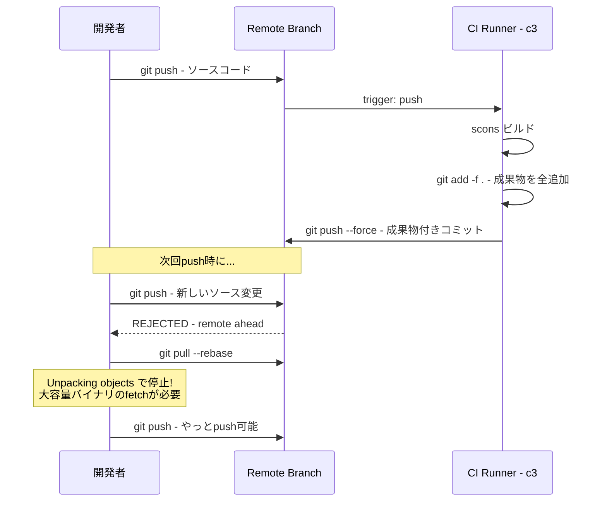
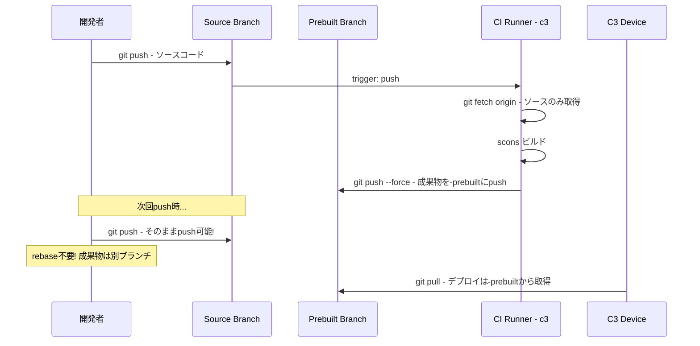
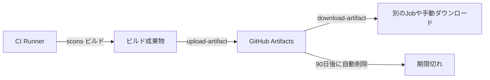

# CIビルド成果物によるRebase問題の対策計画

## 1. 現状分析

### 問題の根本原因

[`compile_frogpilot.yaml`](.github/workflows/compile_frogpilot.yaml:325) の "Commit and Push Build" ステップ:

```yaml
- name: Commit and Push Build
  run: |
    git add -f .                                                    # .gitignoreを無視して全ファイルを強制追加
    git diff-index --quiet HEAD || git commit -m "Compile YozoraPilot [skip ci]"
    git push --force origin HEAD                                    # 同一ブランチにforce push
```

**問題点:**
1. `git add -f .` が [`.gitignore`](.gitignore) の設定（`*.so`, `*.a`, `*.o`, `*.pyc`, `build/` 等）を無視し、**全ビルド成果物を強制コミット**
2. `git push --force origin HEAD` でソースブランチ（例: `test-mazda2-dj-mt-frog`）に**force push**
3. 開発者がpushするたびにCIのビルド成果物コミットが先行しており、`git pull --rebase` で大容量バイナリの `Unpacking objects` が毎回発生

### 影響を受けるブランチ

[`compile_frogpilot.yaml`](.github/workflows/compile_frogpilot.yaml:4) のトリガー対象:
- `feat-mazda2-dj-mt-frog`
- `test-mazda2-dj-mt-frog`
- `dev-mazda2-dj-mt-frog`

### 既存の回避策（部分的）

[`update_pr_branch.yaml`](.github/workflows/update_pr_branch.yaml:36) では、`MAKE-PRS-HERE` への同期時に "Compile FrogPilot" コミットを **revert** している:
```yaml
- name: Revert "Compile YozoraPilot"
  run: |
    COMPILE_COMMIT=$(git rev-list HEAD -n 1 --grep="Compile YozoraPilot" || true)
    git revert --no-edit "$COMPILE_COMMIT"
```
→ これは**別ブランチへの同期時の回避策**に過ぎず、元ブランチの問題は未解決

### 実際のエラー（ターミナル出力から確認）

```
fetch-pack: unexpected disconnect while reading sideband packet
fatal: early EOF
fatal: unpack-objects failed
```
→ まさに `git pull --rebase` 時に大容量バイナリのunpackで失敗している

---

## 2. 現在のワークフロー



---

## 3. 推奨対策: ビルド成果物の別ブランチ分離

### 概要

ビルド成果物をソースブランチとは**別の専用ブランチ**（`<branch>-prebuilt`）にpushし、ソースブランチをクリーンに保つ。

### 対策後のワークフロー



### 具体的な変更内容

#### 変更1: [`compile_frogpilot.yaml`](.github/workflows/compile_frogpilot.yaml) の "Commit and Push Build" ステップ

**現状:**
```yaml
- name: Commit and Push Build
  run: |
    git add -f .
    git diff-index --quiet HEAD || git commit -m "Compile FrogPilot [skip ci]"
    git push --force origin HEAD
    # ... 各種publish処理
```

**変更後:**
```yaml
- name: Commit and Push Build
  run: |
    BRANCH="${{ needs.get_branch.outputs.branch }}"
    PREBUILT_BRANCH="${BRANCH}-prebuilt"

    # ソースブランチのHEADからprebuiltブランチを作成/更新
    git add -f .
    git diff-index --quiet HEAD || git commit -m "Compile YozoraPilot [skip ci]"

    # prebuiltブランチにpush（ソースブランチは変更しない）
    git push --force origin "HEAD:${PREBUILT_BRANCH}"

    if [ "${{ inputs.publish_frogpilot }}" = "true" ]; then
      git push --force origin HEAD:YozoraPilot
    fi

    if [ "${{ inputs.publish_staging }}" = "true" ]; then
      git push --force origin HEAD:YozoraPilot-Staging
    fi

    if [ "${{ inputs.publish_testing }}" = "true" ]; then
      git push --force origin HEAD:YozoraPilot-Testing
    fi

    if [ -n "$CUSTOM_BRANCH" ]; then
      git push --force origin HEAD:"$CUSTOM_BRANCH"
    fi
```

**変更のポイント:**
- `git push --force origin HEAD`（ソースブランチへのforce push）を削除
- 代わりに `git push --force origin "HEAD:${PREBUILT_BRANCH}"` で `-prebuilt` サフィックス付きブランチにpush
- YozoraPilot / Staging / Testing へのpublishは従来通り維持（これらはリリース用なので問題なし）

#### 変更2: CIトリガーの調整（オプション）

`[skip ci]` を使っているため、prebuiltブランチへのpushでCIが再トリガーされる可能性は低いが、念のため確認:

```yaml
on:
  push:
    branches:
      - feat-mazda2-dj-mt-frog
      - test-mazda2-dj-mt-frog
      - dev-mazda2-dj-mt-frog
    # prebuiltブランチはトリガー対象外（サフィックスが異なるため自動的に除外される）
```

#### 変更3: デバイス側のpull先変更

C3デバイスがpullするブランチを `test-mazda2-dj-mt-frog` から `test-mazda2-dj-mt-frog-prebuilt` に変更する必要がある。

---

## 4. C3デバイス側のpull先変更方法（詳細）

### 現在の仕組み

C3デバイス上の `/data/openpilot` はgitリポジトリとしてcloneされており、特定のブランチを追跡しています:

```
/data/openpilot/
  └── .git/
      └── config  →  branch.test-mazda2-dj-mt-frog.remote = origin
                   →  branch.test-mazda2-dj-mt-frog.merge = refs/heads/test-mazda2-dj-mt-frog
```

デバイスは `git pull` でリモートの変更を取得します。

### 変更手順

C3デバイスにSSH接続して以下を実行:

```bash
cd /data/openpilot

# 現在のブランチ確認
git branch -a

# prebuiltブランチを取得
git fetch origin test-mazda2-dj-mt-frog-prebuilt

# prebuiltブランチに切り替え
git checkout test-mazda2-dj-mt-frog-prebuilt

# 以降は git pull だけでprebuiltブランチから取得できる
```

または、ブランチを切り替えずに追跡先だけ変更:

```bash
cd /data/openpilot
git fetch origin
git branch --set-upstream-to=origin/test-mazda2-dj-mt-frog-prebuilt test-mazda2-dj-mt-frog
git pull
```

### YozoraPilotのUIからの更新の場合

YozoraPilotのUIにブランチ選択機能がある場合、そちらの設定も変更が必要になる可能性があります。この場合、YozoraPilotのソースコード内でブランチ名をハードコードしている部分を確認する必要があります。

---

## 5. GitHub Artifactsとは（解説）

### 概要

GitHub Actions Artifacts は、**ワークフローの実行結果を一時的に保存する仕組み**です。



### 具体的な使い方

```yaml
# ビルド成果物をアップロード
- name: Upload Build Artifacts
  uses: actions/upload-artifact@v4
  with:
    name: frogpilot-build
    path: |
      **/*.so
      **/*.a
      selfdrive/
      panda/board/panda.bin.signed
    retention-days: 90  # 90日後に自動削除

# 別のジョブや手動でダウンロード
- name: Download Build Artifacts
  uses: actions/download-artifact@v4
  with:
    name: frogpilot-build
```

### メリット
- **リポジトリにコミットされない** → ブランチがクリーン
- GitHubのWeb UIから手動ダウンロード可能
- CI上でのジョブ間データ共有に便利

### デメリット（このケースでの採用見送り理由）
1. **C3デバイスからの取得が複雑**: デバイスがGitHub APIを叩いてartifactをダウンロードする仕組みが必要
2. **容量制限**: Freeプランではartifact合計500MB/リポジトリ（大容量ビルドには不足する可能性）
3. **有効期限**: デフォルト90日で自動削除（永続的なデプロイソースとして不適切）
4. **認証が必要**: デバイス側にGitHubトークンの設定が必要

---

## 6. 代替案の比較

| 方策 | メリット | デメリット | 推奨度 |
|------|----------|------------|--------|
| **A. 別ブランチ分離** | ソースブランチがクリーン、既存ワークフローとの互換性が高い | デバイス側のpull先変更が必要 | ★★★★★ |
| B. GitHub Artifacts | リポジトリに成果物が入らない | デバイス側でartifact downloadの仕組みが必要、大容量artifactは料金が高い | ★★★☆☆ |
| C. Git LFS | fetchが軽量化される | LFSの設定・料金が発生、結局rebaseは必要 | ★★☆☆☆ |
| D. .gitignore追加のみ | 最もシンプル | デバイスデプロイに成果物が必要なため機能しない | ★☆☆☆☆ |

---

## 7. 実装ステップ

1. `compile_frogpilot.yaml` の "Commit and Push Build" ステップを変更
2. C3デバイスのpull先ブランチを `-prebuilt` に変更
3. 既存の `-prebuilt` ブランチが存在しないことを確認（初回は自動作成される）
4. 動作確認: push → CIビルド → prebuiltブランチに成果物がpushされることを確認
5. 開発者環境で `git pull --rebase` が不要になったことを確認