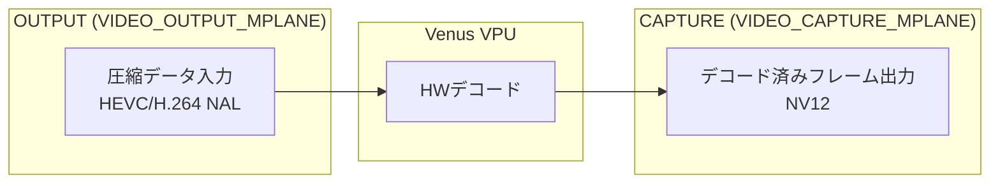
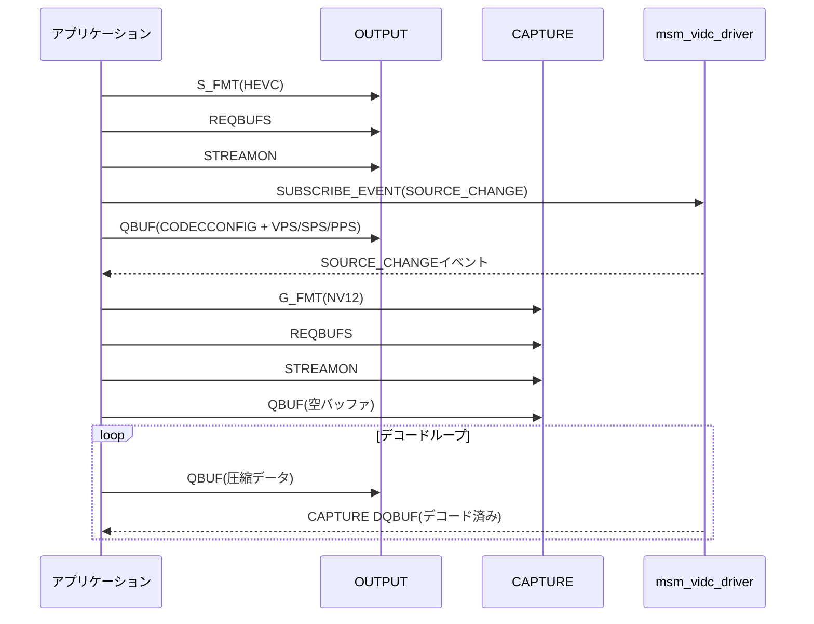
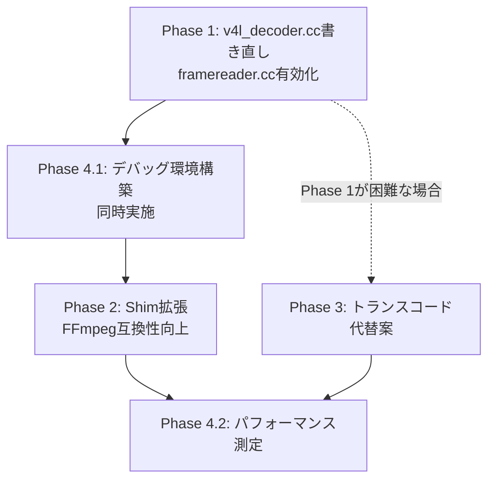

# YozoraPilot ログ録画再生 HWデコード/エンコード 問題点と修正案

## 概要

YozoraPilotのCANログ再生機能（`can_player.py` + `video_player`）におけるHEVC動画のHWデコードが無効化されており、CPUデコード（SW）ではSDM845上で実用的なフレームレートが出ない問題を解決するための修正案。

---

## 現在の実装の問題点

### 1. V4L2デコーダーが無効化されている

[`tools/replay/framereader.cc`](tools/replay/framereader.cc:133) の133行目でHWデコードがハードコードで無効化されている。

```cpp
// NOTE: Direct V4L2 ION decoder disabled for video playback.
// The Venus msm_vidc driver on C3 does not emit SOURCE_CHANGE events
// and rejects CAPTURE STREAMON, making hardware decode impossible.
// CPU decode with multi-threading provides reliable playback instead.
if (false && hw_decoder && codecpar->codec_id == AV_CODEC_ID_HEVC) {
```

**無効化の理由:**
- Venus `msm_vidc_driver` が `SOURCE_CHANGE` イベントを発火しない
- 結果として `CAPTURE STREAMON` が拒否される
- デコーダーがストリームのパラメータ（解像度、ピクセルフォーマット）を確定できない

**根本原因:** コーデック設定データ（VPS/SPS/PPS）を `V4L2_QCOM_BUF_FLAG_CODECCONFIG` フラグ付きで送信していないため、Venusドライバーがストリームを解析できず、SOURCE_CHANGEを発火できない。

### 2. V4L2 M2M Shimの問題

[`frogpilot/can_log/v4l2_m2m_shim.c`](frogpilot/can_log/v4l2_m2m_shim.c:1) でFFmpegの `hevc_v4l2m2m` デコーダー用のシムライブラリを実装しているが、これだけでは不十分。

**シムの限界:**
- ioctlのインターセプトのみで、根本的なメモリ管理の問題を解決していない
- `QUERYBUF` で `V4L2_MEMORY_MMAP` を返すが、実際のバッファ確保は行わない
- `VIDIOC_DQBUF` のインターセプトがない（DMABUF fd管理ができない）
- CODECCONFIGフラグの自動付与がない

### 3. CPUデコードの性能問題

- SWデコード（libde265経由）はSDM845上で非常に低いフレームレート（推定2-5fps）
- 20fpsのリアルタイム再生には全く不十分
- `video_player` の `PREDECODE_QUEUE_SIZE=3` ではバッファリングも不足

### 4. メモリモードの不一致

[`tools/replay/v4l_decoder.cc`](tools/replay/v4l_decoder.cc:65) の `queue_buffer()` 関数:

```cpp
v4l2_buffer v4l_buf = {
  .type = buf_type,
  .index = index,
  .memory = V4L2_MEMORY_USERPTR,   // <-- 問題
  ...
};
```

- YozoraPilotの `v4l_decoder.cc` は `V4L2_MEMORY_USERPTR` を使用
- SDM845のVenusドライバーはCAPTURE側で `V4L2_MEMORY_DMABUF` を要求
- `USERPTR` はOUTPUT側でのみ使用可能、CAPTURE側は `DMABUF` または `MMAP` が必要

### 5. コーデック設定の欠落

- VPS/SPS/PPSを `V4L2_QCOM_BUF_FLAG_CODECCONFIG` フラグ付きで送信する必要がある
- [`v4l_decoder.cc`](tools/replay/v4l_decoder.cc:398) の `feed()` 関数にはこの処理がない
- これがSOURCE_CHANGEイベントが発火しない直接的原因

```cpp
// 現在のfeed() - CODECCONFIGフラグ付与がない
buf_in[buf_idx].sync(VISIONBUF_SYNC_TO_DEVICE);
queueOutputBuffer(buf_idx, (uint32_t)copy_size);
```

---

## SDM845のHWデコード仕様（リサーチ結果）

### Venus VPU仕様

| 項目 | 値 |
|------|-----|
| ハードウェアIP | Venus VPU (Video Processing Unit) |
| Linuxドライバー | msm_vidc_driver |
| デコーダーデバイス | `/dev/video32` |
| エンコーダーデバイス | `/dev/video33` |
| サポートコーデック | H.264, HEVC, VP9（4K@30fpsまで） |
| 出力フォーマット | NV12（Venus修飾付き、ストライドアライメントあり） |
| IONヒープ | ION_SYSTEM_HEAP_ID (25) |

### V4L2 M2M インターフェース構造



### 正しい初期化フロー



---

## 修正案

### Phase 1: openpilot本家のqcom_decoder.ccパターンの移植（最優先）

#### 1.1 v4l_decoder.cc の書き直し

**変更点:**

| 項目 | 現在 | 修正後 |
|------|------|--------|
| CAPTUREメモリモード | `V4L2_MEMORY_USERPTR` | `V4L2_MEMORY_DMABUF` |
| デバイスパス | `/dev/v4l/by-path/platform-aa00000.qcom_vidc-video-index0` | `/dev/video32` |
| CODECCONFIG処理 | なし | VPS/SPS/PPS抽出 + フラグ付与 |
| IONバッファ渡し | `userptr` | `dmabuf` fd |

**具体的な修正内容:**

1. **メモリモード変更**
   - [`queue_buffer()`](tools/replay/v4l_decoder.cc:53) 関数を `buf_type` に応じて `USERPTR` / `DMABUF` を切り替える
   - CAPTURE側は `m.fd` にDMABUF fdを設定

2. **CODECCONFIG処理の追加**
   - `feed()` 関数の先頭で、入力データからVPS/SPS/PPSを抽出
   - NALユニットタイプ判定（HEVC: VPS=32, SPS=33, PPS=34）
   - 抽出したパラメータセットを `V4L2_QCOM_BUF_FLAG_CODECCONFIG` 付きで最初のQBUF

3. **ION/DMABUF対応**
   - `VisionBuf::allocate()` はION確保を行うため、[`buf_out[i].fd`](tools/replay/v4l_decoder.h:53) をDMABUF fdとして使用
   - `VENUS_BUFFER_SIZE` / `VENUS_Y_STRIDE` でアライメント済みサイズを計算（既存コードで対応済み）

#### 1.2 framereader.cc の修正

[`tools/replay/framereader.cc`](tools/replay/framereader.cc:133):

```cpp
// 修正前
if (false && hw_decoder && codecpar->codec_id == AV_CODEC_ID_HEVC) {

// 修正後
if (hw_decoder && codecpar->codec_id == AV_CODEC_ID_HEVC) {
```

- フォールバックパス（CPUデコード）は維持
- `hw_decoder=false` の場合や `open()` 失敗時は従来通りFFmpeg SWデコード

#### 1.3 video_player.cc の最適化

[`frogpilot/can_log/video_player.cc`](frogpilot/can_log/video_player.cc:50):

```cpp
// 修正前
static const int PREDECODE_QUEUE_SIZE = 3;

// 修正後（HWデコード有効時）
static const int PREDECODE_QUEUE_SIZE = 6;  // HWデコードでは先読みを増やせる
```

- HWデコード有効時のキューイング戦略の調整
- `BUFFER_COUNT` は維持（VisionIPCのリングバッファ制約）

### Phase 2: V4L2 M2M Shim の改善

#### 2.1 v4l2_m2m_shim.c の拡張

**追加する機能:**

1. **`VIDIOC_DQBUF` のインターセプト**
   - CAPTURE側DQBUF時にDMABUF fdを正しく返す
   - `m.planes[].m.fd` の設定

2. **`VIDIOC_QBUF` でのCODECCONFIGフラグ自動付与**
   - 最初のOUTPUT QBUFを検出
   - `V4L2_QCOM_BUF_FLAG_CODECCONFIG` を自動設定

3. **IONメモリ確保のサポート**
   - `/dev/ion` オープンとION_ALLOCのラッパー
   - `VIDIOC_REQBUFS` 時にIONバッファを自動確保

```c
// 追加予定: IONバッファ管理
#define ION_SYSTEM_HEAP_ID 25

struct ion_buffer {
    int ion_fd;
    int dmabuf_fd;
    size_t len;
};
```

### Phase 3: 事前エンコード（トランスコード）アプローチ（代替案）

#### 3.1 ログ保存時の再エンコード

- cameradで保存されるHEVCストリームを再生用に低解像度/低ビットレートに事前トランスコード
- [`frogpilot/ui/screenrecorder/omx_encoder.cc`](frogpilot/ui/screenrecorder/omx_encoder.cc:1) のOMXエンコーダーを活用
- 再生時はSWデコードでも実用的なフレームレートを確保

**課題:**
- ログ保存時のCPU負荷増加
- ディスク容量の2倍使用

#### 3.2 プロキシ動画の生成

- ログ読み込み時にHEVC → H.264変換プロキシを生成
- H.264はSWデコードでもHEVCより高速（SDM845の場合約2-3倍）
- プロキシはキャッシュして再利用

**実装案:**
```python
# can_player.py 起動時
proxy_path = segment_path / "fcamera_proxy.mp4"
if not proxy_path.exists():
    subprocess.run(["ffmpeg", "-i", "fcamera.hevc", 
                    "-c:v", "libx264", "-preset", "ultrafast",
                    "-crf", "28", "-vf", "scale=960:600",
                    str(proxy_path)])
```

### Phase 4: テストと検証

#### 4.1 デバッグ環境の構築

既存のデバッグ機構を拡張:

```cpp
// v4l_decoder.cc に既存
const int env_debug_decoder = (getenv("DEBUG_V4L_DECODER") != NULL) ? atoi(getenv("DEBUG_V4L_DECODER")) : 0;
```

**追加デバッグ項目:**
- `DEBUG_V4L_DECODER=2`: IOCTL呼び出しの全ダンプ
- `DEBUG_V4L_DECODER=3`: バッファ内容のhexダンプ

**確認項目:**
- [ ] SOURCE_CHANGEイベントの受信確認
- [ ] CAPTURE STREAMON成功
- [ ] NV12出力のUI表示確認
- [ ] フレームドロップなし

#### 4.2 パフォーマンス測定

| 測定項目 | SWデコード | HWデコード（目標） |
|---------|-----------|------------------|
| フレームレート | 2-5 fps | 20 fps（リアルタイム） |
| CPU使用率（コア1基） | 80-100% | <10% |
| メモリ使用量 | ~200MB | ~100MB（ION含む） |
| 消費電力 | 高 | 低（VPU使用） |

**測定方法:**
```bash
# フレームレート測定
DEBUG_V4L_DECODER=1 ./video_player /data/media/0/realdata/... 2>&1 | grep "getFrame"

# CPU使用率
top -p $(pidof video_player) -d 1

# メモリ使用量
cat /proc/$(pidof video_player)/status | grep VmRSS
```

---

## 推奨優先順位



| 優先度 | フェーズ | 内容 | 理由 |
|--------|---------|------|------|
| 1 | **Phase 1** | openpilot本家パターン移植 | 最も確実で実績あり。本家の `qcom_decoder.cc` / `v4l_encoder.cc` を参考 |
| 2 | **Phase 4.1** | デバッグ環境構築 | Phase 1と同時。問題の早期発見に必須 |
| 3 | **Phase 2** | Shim拡張 | Phase 1完了後。FFmpeg経由でも動作するように |
| 4 | **Phase 3** | トランスコード | Phase 1が困難な場合のフォールバック |
| 5 | **Phase 4.2** | パフォーマンス最適化 | 最終調整。20fps安定化を目指す |

---

## 関連ファイル一覧

| ファイル | 役割 | 修正要否 | 優先度 |
|---------|------|---------|--------|
| [`tools/replay/v4l_decoder.cc`](tools/replay/v4l_decoder.cc) | V4L2 HWデコーダー | ★最重要（書き直し） | Phase 1 |
| [`tools/replay/v4l_decoder.h`](tools/replay/v4l_decoder.h) | V4L2 HWデコーダーヘッダ | ★重要（インターフェース変更） | Phase 1 |
| [`tools/replay/framereader.cc`](tools/replay/framereader.cc) | フレームリーダー | ★重要（HWデコード有効化） | Phase 1 |
| [`frogpilot/can_log/video_player.cc`](frogpilot/can_log/video_player.cc) | 動画再生プレイヤー | △（最適化） | Phase 1後 |
| [`frogpilot/can_log/v4l2_m2m_shim.c`](frogpilot/can_log/v4l2_m2m_shim.c) | V4L2 M2Mシム | △（拡張） | Phase 2 |
| [`frogpilot/can_log/can_player.py`](frogpilot/can_log/can_player.py) | CANプレイヤー | ○（参照のみ） | - |
| [`frogpilot/ui/screenrecorder/omx_encoder.cc`](frogpilot/ui/screenrecorder/omx_encoder.cc) | OMXエンコーダー | ○（Phase 3参照） | Phase 3 |

---

## 参考: openpilot本家の実装パターン

本家の `system/camerad/cameras/v4l_encoder.cc` および `selfdrive/ui/replay/v4l_decoder.cc`（存在する場合）を参考に、以下のパターンを移植する。

### 本家の主要な設計ポイント

1. **DMABUF使用**: CAPTURE側は必ずDMABUF。`VisionBuf` の `fd` メンバを直接使用
2. **CODECCONFIG分離**: ストリーム開始時にパラメータセットを分離送信
3. **イベント駆動**: `SOURCE_CHANGE` を正しく待ち、それからCAPTUREを設定
4. **デバイスパス**: `/dev/video32` を直接使用（by-pathシンボリックリンクは使用しない）

---

## リスクと対策

| リスク | 影響 | 対策 |
|--------|------|------|
| DMABUF変更で既存機能破壊 | 高 | `V4L2_MEMORY_USERPTR` フォールバックを残す |
| Venusドライバー互換性 | 中 | 複数デバイス（C3/C3X）でのテスト必須 |
| IONメモリ枯渇 | 中 | バッファ数を最小限（4-6）に抑制 |
| ビルド破壊 | 低 | `#ifdef QCOM2` ガードを維持 |

---

## 次のアクション

1. **Phase 1.1** の実装: `v4l_decoder.cc` の `DMABUF` 対応と `CODECCONFIG` 処理追加
2. **Phase 1.2** の実装: `framereader.cc` の `false` → `true` 変更
3. デバイス上でのビルドとテスト
4. デバッグログ確認 → SOURCE_CHANGE受信、CAPTURE STREAMON成功を確認
5. 問題が解決しない場合は Phase 3（トランスコード）を検討
