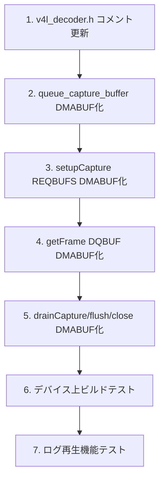

# HWデコード/エンコード問題解決 実装計画

## 1. 現在のコード状態分析

### 1.1 確認済み問題点

| 項目 | 状態 | 詳細 |
|------|------|------|
| `framereader.cc` の `if (false &&` | **既に修正済み** | Line 134 で `if (hw_decoder && codecpar->codec_id == AV_CODEC_ID_HEVC)` になっている。ユーザーの報告は古い情報の可能性あり |
| `v4l_decoder.cc` CAPTURE側のUSERPTR | **未修正** | Line 221 で `V4L2_MEMORY_USERPTR` を使用。SDM845 VenusはCAPTURE側でDMABUFを要求 |
| CODECCONFIG処理 | **既に実装済み** | `v4l_decoder.cc` Line 411-422 で `feed()` 内に実装。ただしprepend方式で、分離送信も検討が必要 |
| `v4l2_m2m_shim.c` | **DMABUF対応済み** | LD_PRELOAD shimとしてDMABUF+CODECCONFIGをサポート。ただし直接実装との整合性が必要 |

### 1.2 ファイル構成

```
tools/replay/
├── framereader.cc      # VideoDecoder::open() でV4L2直接デコーダを初期化
├── framereader.h       # クラス定義
├── v4l_decoder.cc      # V4LDecoder 実装（CAPTURE=USERPTRが問題）
├── v4l_decoder.h       # V4LDecoder ヘッダ
└── util.h              # 共通ユーティリティ

frogpilot/can_log/
├── v4l2_m2m_shim.c     # LD_PRELOAD shim（DMABUF対応済み）
├── video_player.cc     # ログ再生UI
└── test_v4l2_decoder*.py # テストスクリプト

msgq_repo/msgq/visionipc/
└── visionbuf.h         # VisionBuf（ION allocate/import/sync/free）
```

---

## 2. Phase 1 実装計画（openpilot本家パターン移植）

### 2.1 変更対象ファイルと変更内容

#### A. `tools/replay/v4l_decoder.cc` - CAPTURE側DMABUF化

**変更箇所1: `setupCapture()` - REQBUFSをDMABUFに変更**
```cpp
// BEFORE (Line 221)
if (!request_buffers(fd, V4L2_BUF_TYPE_VIDEO_CAPTURE_MPLANE, V4L_DEC_BUF_OUT_COUNT, V4L2_MEMORY_USERPTR)) {

// AFTER
if (!request_buffers(fd, V4L2_BUF_TYPE_VIDEO_CAPTURE_MPLANE, V4L_DEC_BUF_OUT_COUNT, V4L2_MEMORY_DMABUF)) {
```

**変更箇所2: CAPTUREバッファ確保方法の変更**
```cpp
// BEFORE (Line 214-218)
for (int i = 0; i < V4L_DEC_BUF_OUT_COUNT; i++) {
  buf_out[i].allocate(output_buf_size);  // ION allocate + mmap
  LOG_DEBUG("CAPTURE buffer %d: addr=%p len=%zu", i, buf_out[i].addr, buf_out[i].len);
}

// AFTER: DMABUF fdを取得し、V4L2に登録
for (int i = 0; i < V4L_DEC_BUF_OUT_COUNT; i++) {
  buf_out[i].allocate(output_buf_size);  // ION allocate -> fd取得
  // DMABUFではaddrではなくfdをV4L2に渡す
  LOG_DEBUG("CAPTURE buffer %d: fd=%d len=%zu", i, buf_out[i].fd, buf_out[i].len);
}
```

**変更箇所3: `queue_capture_buffer()` - DMABUF対応**
```cpp
// BEFORE (Line 76-92)
static void queue_capture_buffer(int fd, int index, VisionBuf *buf) {
  v4l2_plane plane = {
    .length = (unsigned int)buf->len,
    .m = { .userptr = (unsigned long)buf->addr, },  // USERPTR: mmap addr
    .bytesused = 0,
  };
  v4l2_buffer v4l_buf = {
    .type = V4L2_BUF_TYPE_VIDEO_CAPTURE_MPLANE,
    .index = (unsigned int)index,
    .memory = V4L2_MEMORY_USERPTR,
    .m = { .planes = &plane, },
    .length = 1,
  };
  checked_ioctl(fd, VIDIOC_QBUF, &v4l_buf);
}

// AFTER
static void queue_capture_buffer(int fd, int index, VisionBuf *buf) {
  v4l2_plane plane = {
    .length = (unsigned int)buf->len,
    .m = { .fd = buf->fd, },  // DMABUF: ION fd
    .bytesused = 0,
  };
  v4l2_buffer v4l_buf = {
    .type = V4L2_BUF_TYPE_VIDEO_CAPTURE_MPLANE,
    .index = (unsigned int)index,
    .memory = V4L2_MEMORY_DMABUF,
    .m = { .planes = &plane, },
    .length = 1,
  };
  checked_ioctl(fd, VIDIOC_QBUF, &v4l_buf);
}
```

**変更箇所4: `getFrame()` - DQBUFとデータコピー**
```cpp
// BEFORE (Line 558-568)
v4l2_buffer v4l_buf = {
  .type = V4L2_BUF_TYPE_VIDEO_CAPTURE_MPLANE,
  .memory = V4L2_MEMORY_USERPTR,
  ...
};

// AFTER
v4l2_buffer v4l_buf = {
  .type = V4L2_BUF_TYPE_VIDEO_CAPTURE_MPLANE,
  .memory = V4L2_MEMORY_DMABUF,
  ...
};
// DMABUFの場合、DQBUF後にfdが有効。mmap済みaddrからコピー可能
```

**変更箇所5: `drainCapture()`, `flush()`, `close()` - DMABUF対応**
- `drainCapture()` の `V4L2_MEMORY_USERPTR` → `V4L2_MEMORY_DMABUF`
- `flush()` の `V4L2_MEMORY_USERPTR` → `V4L2_MEMORY_DMABUF`
- `close()` の `request_buffers(..., V4L2_MEMORY_USERPTR)` → `V4L2_MEMORY_DMABUF`

#### B. `tools/replay/v4l_decoder.h` - コメント更新
```cpp
// BEFORE
// Uses USERPTR for both OUTPUT and CAPTURE (no DMA BUF required).

// AFTER
// Uses USERPTR for OUTPUT (compressed HEVC input)
// Uses DMABUF for CAPTURE (decoded NV12 output) - required by SDM845 Venus
```

#### C. `tools/replay/framereader.cc` - 確認のみ
- Line 134: `if (hw_decoder && codecpar->codec_id == AV_CODEC_ID_HEVC)` となっており、既に有効化済み
- 変更不要（ユーザーの報告は古い情報）

### 2.2 実装手順



---

## 3. Phase 2（オプション）- CODECCONFIG送信方式の改善

### 3.1 現在の実装（prepend方式）
```cpp
// v4l_decoder.cc Line 411-422
if (!extradata.empty() && !extradata_sent) {
  if (copy_size + extradata.size() <= buf_in[buf_idx].len) {
    memmove((uint8_t*)buf_in[buf_idx].addr + extradata.size(), buf_in[buf_idx].addr, copy_size);
    memcpy(buf_in[buf_idx].addr, extradata.data(), extradata.size());
    copy_size += extradata.size();
    flags = V4L2_QCOM_BUF_FLAG_CODECCONFIG;
    extradata_sent = true;
  }
}
```

**問題**: 最初のフレームにextradataをprependする方式。Venusによっては別送の方が安定する場合がある。

### 3.2 改善案（分離送信方式）
```cpp
// 方式A: 別バッファでCODECCONFIGのみ送信（推奨）
if (!extradata.empty() && !extradata_sent) {
  int config_idx = free_input_bufs.pop();
  memcpy(buf_in[config_idx].addr, extradata.data(), extradata.size());
  buf_in[config_idx].sync(VISIONBUF_SYNC_TO_DEVICE);
  queueOutputBuffer(config_idx, extradata.size(), V4L2_QCOM_BUF_FLAG_CODECCONFIG);
  extradata_sent = true;
  // その後、通常のフレームデータを別バッファで送信
}
```

---

## 4. テスト戦略

### 4.1 単体テスト（デバイス上）

```bash
# 1. ビルド
scons -j$(nproc) tools/replay/

# 2. V4L2デコーダ直接テスト（test_v4l2_decoder2.pyを活用）
cd /data/openpilot
DEBUG_V4L_DECODER=1 python frogpilot/can_log/test_v4l2_decoder2.py /data/media/0/realdata/xxx.hevc

# 3. ログ再生テスト
cd /data/openpilot
DEBUG_V4L_DECODER=1 ./frogpilot/can_log/video_player /data/media/0/realdata/
```

### 4.2 確認項目

| # | 確認項目 | 期待結果 |
|---|----------|----------|
| 1 | `setupCapture()` の `REQBUFS(CAPTURE, DMABUF)` | 成功（errno=0） |
| 2 | `queue_capture_buffer()` の `QBUF(CAPTURE, DMABUF)` | 成功、fdが正しく設定される |
| 3 | `getFrame()` の `DQBUF(CAPTURE)` | POLLIN後に成功、bytesused > 0 |
| 4 | デコード後のNV12データ | 正しいstrideでコピーされる |
| 5 | フレームレート | CPU再生時の2-3倍（目標: 15-20fps） |
| 6 | フォールバック動作 | V4L2失敗時に自動的にCPUデコードに切り替わる |

### 4.3 デバッグ方法

```bash
# 詳細ログ出力
export DEBUG_V4L_DECODER=1

# v4l2_shim併用時
LD_PRELOAD=/data/openpilot/frogpilot/can_log/v4l2_m2m_shim.so DEBUG_V4L_DECODER=1 ./video_player

# dmesgでVenusドライバログ確認
adb shell dmesg | grep -i venus
adb shell dmesg | grep -i msm_vidc
```

---

## 5. 代替案評価

### 5.1 代替案A: `v4l2_m2m_shim.c` の継続使用

| 観点 | 評価 |
|------|------|
| **利点** | 既にDMABUF+CODECCONFIG対応済み。最小限の変更で動作可能 |
| **欠点** | LD_PRELOAD方式は脆弱。環境変数設定忘れ、他プロセスへの影響、メンテナンス性低下 |
| **結論** | 一時的な回避策として有効だが、根本解決には直接実装の修正が必要 |

### 5.2 代替案B: 事前トランスコード

| 観点 | 評価 |
|------|------|
| **利点** | HEVC→H.264変換でFFmpeg V4L2 M2Mが動作する可能性。HWデコード不要の場合もある |
| **欠点** | 変換時間がかかる。ストレージ容量増加。画質劣化の可能性 |
| **結論** | 緊急回避策として検討可能だが、UXを著しく損なう |

### 5.3 代替案C: FFmpeg `hevc_v4l2m2m` デコーダの使用

| 観点 | 評価 |
|------|------|
| **利点** | 標準的なV4L2 M2M経由。FFmpegがバッファ管理を抽象化 |
| **欠点** | `framereader.cc` Line 173-220 に既に実装があるが、shimなしでは動作しない。DMABUF問題は同様 |
| **結論** | 直接V4L2実装と組み合わせるか、shim必須 |

### 5.4 推奨アプローチ

**Phase 1**: `v4l_decoder.cc` のCAPTURE側DMABUF化（本計画のメイン）
**Phase 2**: CODECCONFIG分離送信の検討
**Phase 3**: `v4l2_m2m_shim.c` の段階的廃止（直接実装が安定した後）

---

## 6. リスクと対策

| リスク | 影響 | 対策 |
|--------|------|------|
| DMABUF化後もVenusが動作しない | 高 | フォールバック機構（CPUデコード）を維持。`v4l2_m2m_shim.c` を併用可能にする |
| ION bufferのfd取得失敗 | 中 | `VisionBuf::allocate()` の実装を確認。fd=0の場合はエラー処理 |
| パフォーマンス改善なし | 中 | ボトルネックがデコード以外（ファイルI/O、描画）の可能性を検討 |
| ビルドエラー | 低 | `V4L2_MEMORY_DMABUF` の定義確認（古いカーネルヘッダでは未定義の可能性） |

---

## 7. 実装TODO（Codeモード用）

- [ ] `tools/replay/v4l_decoder.h` コメント更新（USERPTR→DMABUF）
- [ ] `tools/replay/v4l_decoder.cc` `queue_capture_buffer()` DMABUF化
- [ ] `tools/replay/v4l_decoder.cc` `setupCapture()` REQBUFS DMABUF化
- [ ] `tools/replay/v4l_decoder.cc` CAPTUREバッファallocate後のfd確認
- [ ] `tools/replay/v4l_decoder.cc` `getFrame()` DQBUF DMABUF化
- [ ] `tools/replay/v4l_decoder.cc` `drainCapture()` DMABUF化
- [ ] `tools/replay/v4l_decoder.cc` `flush()` DMABUF化
- [ ] `tools/replay/v4l_decoder.cc` `close()` DMABUF化
- [ ] `tools/replay/framereader.cc` 確認（変更不要の可能性）
- [ ] デバイス上ビルドテスト
- [ ] ログ再生機能統合テスト
