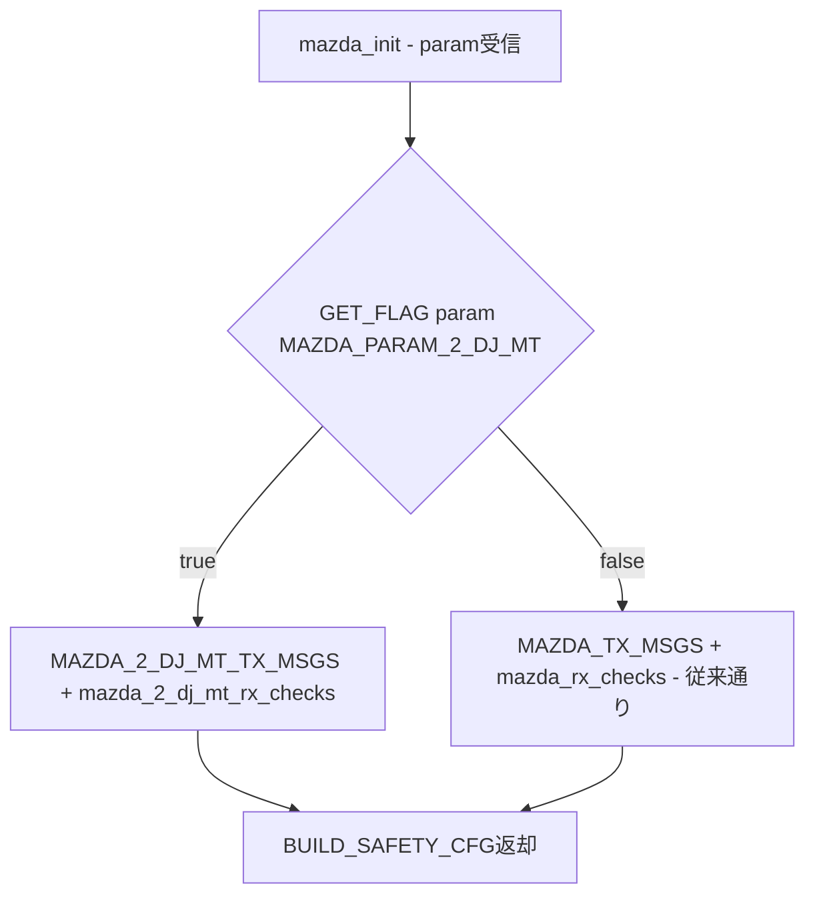
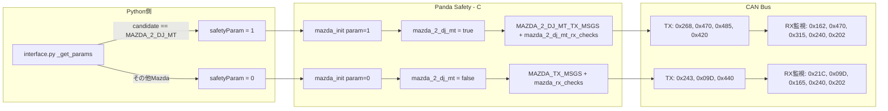

# Mazda 2 DJ MT 向け Panda Safety 修正 設計ドキュメント

## 1. 修正方針の概要

### 問題
現在の [`safety_mazda.h`](panda/board/safety/safety_mazda.h) は `mazda_2017.dbc` のCAN IDでハードコードされており、Mazda 2 DJ MT（異なるCAN IDを使用）では全TXメッセージがブロックされ、RXチェックも失敗する。

### 解決アプローチ
**Toyota / Subaru パターンを採用**: `safety_param` のビットフラグで車種を判別し、`mazda_init()` で条件付きTX/RX設定を選択する。他車種で実績のある [`GET_FLAG()`](panda/board/safety_declarations.h:5) マクロを活用する。



### 後方互換性
- `safety_param = 0`（デフォルト）の場合、従来の [`MAZDA_TX_MSGS`](panda/board/safety/safety_mazda.h:26) / [`mazda_rx_checks`](panda/board/safety/safety_mazda.h:28) が使用される
- 既存のMazda車種（CX-5, CX-9, Mazda 3, Mazda 6）に影響なし

---

## 2. `safety_mazda.h` の具体的な変更内容

### 2.1 新しいCAN ID定義の追加

```c
// ===== 従来のCAN ID（mazda_2017.dbc）=====
#define MAZDA_LKAS          0x243
#define MAZDA_LKAS_HUD      0x440
#define MAZDA_CRZ_CTRL      0x21c
#define MAZDA_CRZ_BTNS      0x09d
#define MAZDA_STEER_TORQUE  0x240
#define MAZDA_ENGINE_DATA   0x202
#define MAZDA_PEDALS        0x165

// ===== Mazda 2 DJ MT 専用CAN ID（mazda_2_dj_mt.dbc）=====
#define MAZDA_2_DJ_MT_LKAS       0x268
#define MAZDA_2_DJ_MT_LKAS_HUD   0x485
#define MAZDA_2_DJ_MT_CRZ_CTRL   0x162
#define MAZDA_2_DJ_MT_CRZ_BTNS   0x470
#define MAZDA_2_DJ_MT_PEDALS     0x315
#define MAZDA_2_DJ_MT_BCM        0x420
// STEER_TORQUE = 0x240 と ENGINE_DATA = 0x202 は共通

// ===== safety_param フラグ =====
const uint16_t MAZDA_PARAM_2_DJ_MT = 1U;
```

### 2.2 新しいTX/RX配列の追加

```c
// ===== Mazda 2 DJ MT TX許可リスト =====
const CanMsg MAZDA_2_DJ_MT_TX_MSGS[] = {
  {MAZDA_2_DJ_MT_LKAS, 0, 8},       // CAM_LKAS (0x268)
  {MAZDA_2_DJ_MT_CRZ_BTNS, 0, 8},   // CRZ_BTNS (0x470)
  {MAZDA_2_DJ_MT_LKAS_HUD, 0, 8},   // CAM_LANEINFO (0x485)
  {MAZDA_2_DJ_MT_BCM, 0, 8},        // BCM ドアロック (0x420)
};

// ===== Mazda 2 DJ MT RXチェック =====
RxCheck mazda_2_dj_mt_rx_checks[] = {
  {.msg = {{MAZDA_2_DJ_MT_CRZ_CTRL,   0, 8, .frequency = 50U}, { 0 }, { 0 }}},
  {.msg = {{MAZDA_2_DJ_MT_CRZ_BTNS,   0, 8, .frequency = 10U}, { 0 }, { 0 }}},
  {.msg = {{MAZDA_STEER_TORQUE,        0, 8, .frequency = 83U}, { 0 }, { 0 }}},  // 共通
  {.msg = {{MAZDA_ENGINE_DATA,         0, 8, .frequency = 100U}, { 0 }, { 0 }}}, // 共通
  {.msg = {{MAZDA_2_DJ_MT_PEDALS,     0, 8, .frequency = 50U}, { 0 }, { 0 }}},
};
```

### 2.3 グローバル変数の追加

```c
bool mazda_2_dj_mt = false;
```

### 2.4 `mazda_init()` の変更

```c
static safety_config mazda_init(uint16_t param) {
  mazda_2_dj_mt = GET_FLAG(param, MAZDA_PARAM_2_DJ_MT);

  safety_config ret;
  if (mazda_2_dj_mt) {
    ret = BUILD_SAFETY_CFG(mazda_2_dj_mt_rx_checks, MAZDA_2_DJ_MT_TX_MSGS);
  } else {
    ret = BUILD_SAFETY_CFG(mazda_rx_checks, MAZDA_TX_MSGS);
  }
  return ret;
}
```

### 2.5 `mazda_rx_hook()` の変更

各アドレスチェックを `mazda_2_dj_mt` フラグで分岐:

```c
static void mazda_rx_hook(const CANPacket_t *to_push) {
  if ((int)GET_BUS(to_push) == MAZDA_MAIN) {
    int addr = GET_ADDR(to_push);

    // --- 車速（ENGINE_DATA = 0x202 は共通）---
    if (addr == MAZDA_ENGINE_DATA) {
      int speed = (GET_BYTE(to_push, 2) << 8) | GET_BYTE(to_push, 3);
      vehicle_moving = speed > 10;
    }

    // --- ステアリングトルク（STEER_TORQUE = 0x240 は共通）---
    if (addr == MAZDA_STEER_TORQUE) {
      int torque_driver_new = GET_BYTE(to_push, 0) - 127U;
      update_sample(&torque_driver, torque_driver_new);
    }

    // --- クルーズ制御状態 ---
    if (mazda_2_dj_mt) {
      if (addr == MAZDA_2_DJ_MT_CRZ_CTRL) {
        bool cruise_engaged = GET_BYTE(to_push, 0) & 0x8U;
        pcm_cruise_check(cruise_engaged);
      }
    } else {
      if (addr == MAZDA_CRZ_CTRL) {
        bool cruise_engaged = GET_BYTE(to_push, 0) & 0x8U;
        pcm_cruise_check(cruise_engaged);
      }
    }

    // --- アクセルペダル（ENGINE_DATA = 0x202 は共通）---
    if (addr == MAZDA_ENGINE_DATA) {
      gas_pressed = (GET_BYTE(to_push, 4) || (GET_BYTE(to_push, 5) & 0xF0U));
    }

    // --- ブレーキペダル ---
    if (mazda_2_dj_mt) {
      if (addr == MAZDA_2_DJ_MT_PEDALS) {
        brake_pressed = (GET_BYTE(to_push, 0) & 0x10U);
      }
    } else {
      if (addr == MAZDA_PEDALS) {
        brake_pressed = (GET_BYTE(to_push, 0) & 0x10U);
      }
    }

    // --- stock ECU検出（LKASメッセージ）---
    bool stock_lkas = mazda_2_dj_mt ? (addr == MAZDA_2_DJ_MT_LKAS) : (addr == MAZDA_LKAS);
    generic_rx_checks(stock_lkas);
  }
}
```

### 2.6 `mazda_tx_hook()` の変更

```c
static bool mazda_tx_hook(const CANPacket_t *to_send) {
  bool tx = true;
  int bus = GET_BUS(to_send);
  if (bus == MAZDA_MAIN) {
    int addr = GET_ADDR(to_send);

    // --- ステアリングコマンドチェック ---
    int lkas_addr = mazda_2_dj_mt ? MAZDA_2_DJ_MT_LKAS : MAZDA_LKAS;
    if (addr == lkas_addr) {
      int desired_torque = (((GET_BYTE(to_send, 0) & 0x0FU) << 8) | GET_BYTE(to_send, 1)) - 2048U;
      if (steer_torque_cmd_checks(desired_torque, -1, MAZDA_STEERING_LIMITS)) {
        tx = false;
      }
    }

    // --- クルーズボタンチェック ---
    int crz_btns_addr = mazda_2_dj_mt ? MAZDA_2_DJ_MT_CRZ_BTNS : MAZDA_CRZ_BTNS;
    if (addr == crz_btns_addr) {
      bool cancel_cmd = (GET_BYTE(to_send, 0) == 0x1U);
      if (!controls_allowed && !cancel_cmd) {
        tx = false;
      }
    }
  }
  return tx;
}
```

### 2.7 `mazda_fwd_hook()` の変更

```c
static int mazda_fwd_hook(int bus, int addr) {
  int bus_fwd = -1;

  if (bus == MAZDA_MAIN) {
    bus_fwd = MAZDA_CAM;
  } else if (bus == MAZDA_CAM) {
    bool block;
    if (mazda_2_dj_mt) {
      block = (addr == MAZDA_2_DJ_MT_LKAS) || (addr == MAZDA_2_DJ_MT_LKAS_HUD);
    } else {
      block = (addr == MAZDA_LKAS) || (addr == MAZDA_LKAS_HUD);
    }
    if (!block) {
      bus_fwd = MAZDA_MAIN;
    }
  }

  return bus_fwd;
}
```

---

## 3. `interface.py` / `values.py` の変更内容

### 3.1 [`values.py`](selfdrive/car/mazda/values.py) の変更

変更なし。[`MazdaFlags.MT = 2`](selfdrive/car/mazda/values.py:44) はPython側のフラグとして既に定義済み。`MAZDA_2_DJ_MT` の [`flags=MazdaFlags.GEN1 | MazdaFlags.MT`](selfdrive/car/mazda/values.py:82) も既に設定済み。

### 3.2 [`interface.py`](selfdrive/car/mazda/interface.py) の変更

[`_get_params()`](selfdrive/car/mazda/interface.py:15) でMazda 2 DJ MTの場合に `safetyParam` を設定:

```python
@staticmethod
def _get_params(ret, candidate, fingerprint, car_fw, experimental_long, docs, frogpilot_toggles):
    ret.carName = "mazda"
    ret.radarUnavailable = True
    # ...（既存コード）...

    # Mazda 2 DJ MT の場合、safety_param にフラグを設定
    if candidate == CAR.MAZDA_2_DJ_MT:
      ret.safetyConfigs[0].safetyParam = 1  # MAZDA_PARAM_2_DJ_MT

    return ret
```

現在の [`ret.safetyConfigs = [get_safety_config(car.CarParams.SafetyModel.mazda)]`](selfdrive/car/mazda/interface.py:17) は `safetyParam` を渡さない（デフォルト0）ため、既存車種は影響を受けない。

---

## 4. safety_param の値の定義

| 値 | 定数名 | 意味 |
|---|---|---|
| `0` | （デフォルト） | 従来のMazda車種（mazda_2017.dbc） |
| `1` | `MAZDA_PARAM_2_DJ_MT` | Mazda 2 DJ MT（mazda_2_dj_mt.dbc） |

`safety_param` は `uint16_t` で、ビットフラグとして使用する。将来の拡張用にビット1以上を予約可能。

---

## 5. データフロー全体図



---

## 6. リスクと注意点

### 6.1 高リスク
- **CAN IDの誤設定**: DBCファイルとsafetyコードのCAN IDが一致しない場合、車両制御不能の可能性あり。実装前にDBC定義と突合せを行うこと。
- **STEER_TORQUEとENGINE_DATAの共通性**: これら2つのメッセージは両DBCで同じCAN ID（0x240, 0x202）を使用するが、**シグナルのバイトレイアウトが同じかどうか**をDBCファイルで確認すること。レイアウトが異なる場合、`rx_hook`内のパース処理も分岐が必要。

### 6.2 中リスク
- **CRZ_CTRLのパース**: `GET_BYTE(to_push, 0) & 0x8U` でcruise_engagedを判定しているが、Mazda 2 DJ MTの0x162メッセージで同じビット位置がcruise_engagedを意味するか確認が必要。DBCファイルで `CRZ_CTRL` のシグナル定義を確認すること。
- **PEDALSのパース**: `GET_BYTE(to_push, 0) & 0x10U` がbrake_pressedを意味するか、Mazda 2 DJ MTの0x315メッセージで確認が必要。
- **BCM（0x420）のTXチェック**: `tx_hook`でBCMメッセージの内容チェックが未実装。ドアロック制御に悪用されるリスクはないか検討が必要（現在はTX許可リストに載っているだけで内容チェックなし）。

### 6.3 低リスク
- **CRZ_BTNSのパース**: `tx_hook`で `GET_BYTE(to_send, 0) == 0x1U` でcancel_cmdを判定しているが、Mazda 2 DJ MTの0x470メッセージでcancelのバイト値が同じか確認が必要。[`mazdacan.py`](selfdrive/car/mazda/mazdacan.py:100) の `create_button_cmd` はDBC名でパッキングするため、safety側のバイト値チェックがDBC出力と一致するか検証が必要。
- **FWD hook**: BCM（0x420）はCAMバスからは来ないため、fwd_hookでのブロック判定は不要。

### 6.4 テスト戦略
- Mazda 2 DJ MT専用のテストケースを追加し、以下を検証:
  - TX許可リスト（0x268, 0x470, 0x485, 0x420 が許可されること）
  - TXブロック（未定義アドレスがブロックされること）
  - RXチェック（各メッセージのfrequencyチェック）
  - ステアリングトルクリミット
  - FWDブロック（0x268, 0x485 がCAM→MAINに転送されないこと）
  - 従来車種の後方互換性（param=0で従来通り動作すること）

---

## 7. 実装TODO

1. `safety_mazda.h` にMazda 2 DJ MT用CAN ID定義を追加
2. `safety_mazda.h` に `MAZDA_2_DJ_MT_TX_MSGS` と `mazda_2_dj_mt_rx_checks` を追加
3. `safety_mazda.h` の `mazda_init()` を `safety_param` ベースの分岐に変更
4. `safety_mazda.h` の `mazda_rx_hook()` を `mazda_2_dj_mt` フラグで分岐
5. `safety_mazda.h` の `mazda_tx_hook()` を `mazda_2_dj_mt` フラグで分岐
6. `safety_mazda.h` の `mazda_fwd_hook()` を `mazda_2_dj_mt` フラグで分岐
7. `interface.py` でMazda 2 DJ MTに `safetyParam = 1` を設定
8. DBCファイルでシグナルレイアウトの互換性を確認
9. テストケースを追加