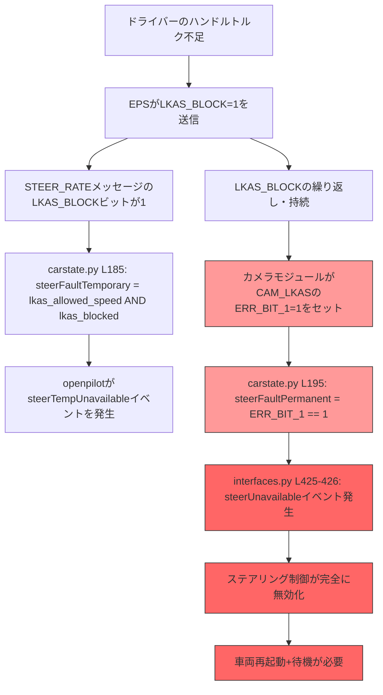
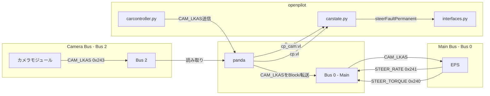
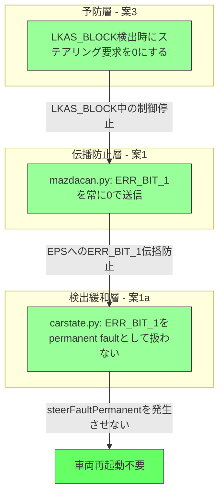

# Mazda LKAS Fault対策 - 分析と修正設計

## 1. 問題の概要

Mazda 2 DJ MTでYozoraPilot/openpilotによるステアリング制御中にLKAS Faultが発生すると、車両を再起動して約1分待たないとFaultが消えない。これにより利便性が大きく損なわれる。

## 2. エラー伝播チェーンの詳細分析



### 2.1 CAN メッセージの流れ



### 2.2 重要な発見: CAM_LKASメッセージの二重性

**CAM_LKAS（ID: 0x243 / 0x579）は、カメラバスから読み取られると同時に、openpilotからも送信される。**

- **読み取り側** ([`carstate.py:193-195`](selfdrive/car/mazda/carstate.py:193)):
  ```python
  self.cam_lkas = cp_cam.vl["CAM_LKAS"]
  ret.steerFaultPermanent = cp_cam.vl["CAM_LKAS"]["ERR_BIT_1"] == 1
  ```
  カメラバス（Bus 2）からカメラモジュールが送信するCAM_LKASを読み取っている。

- **送信側** ([`mazdacan.py:4-62`](selfdrive/car/mazda/mazdacan.py:4)):
  ```python
  def create_steering_control(packer, CP, frame, apply_steer, lkas):
      # copy values from camera
      b1 = int(lkas["BIT_1"])
      er1 = int(lkas["ERR_BIT_1"])  # ← カメラから読んだ値をそのままコピー
      ...
      values = {
          "ERR_BIT_1": er1,  # ← EPSに送信
          ...
      }
  ```
  カメラから読んだCAM_LKASの値をベースに新しいCAM_LKASメッセージを構築し、**メインバス（Bus 0）のEPSに送信**している。

- **転送制御** ([`safety_mazda.h:217-231`](panda/board/safety/safety_mazda.h:217)):
  ```c
  static int mazda_fwd_hook(int bus, int addr) {
    if (bus == MAZDA_MAIN) {
      bus_fwd = MAZDA_CAM;       // Main → Cam へ転送
    } else if (bus == MAZDA_CAM) {
      bool block = (addr == MAZDA_LKAS) || (addr == MAZDA_LKAS_HUD);
      if (!block) {
        bus_fwd = MAZDA_MAIN;    // Cam → Main へはLKAS系をブロック
      }
    }
  }
  ```
  カメラからのCAM_LKASは**Main Busに転送されない**（pandaがブロックする）。openpilotが代わりにCAM_LKASをMain Busに送信する。

### 2.3 ERR_BIT_1の正体

**ERR_BIT_1はカメラモジュールの内部状態を示すビット。** カメラがLKAS_BLOCKの継続を検知すると、内部エラー状態としてERR_BIT_1=1をセットする。このビットはカメラモジュールの内部状態であり、車両再起動によってのみクリアされる。

しかし、**openpilotはこのERR_BIT_1=1の値をそのままEPSに転送している。** つまり:

1. カメラがERR_BIT_1=1をセット（Bus 2）
2. openpilotが読み取り（cp_cam）
3. openpilotがERR_BIT_1=1のまま新しいCAM_LKASを作成（mazdacan.py）
4. EPSがERR_BIT_1=1を受信し続ける（Bus 0）
5. EPS側でもエラー状態が維持される可能性がある

## 3. 各対策案の評価

### 案1: CAM_LKASメッセージのERR_BIT_1を強制的に0にする ★推奨

**変更ファイル**: [`mazdacan.py`](selfdrive/car/mazda/mazdacan.py:13)

**現在のコード**:
```python
# mazdacan.py L13
er1 = int(lkas["ERR_BIT_1"])
```

**提案するコード**:
```python
# mazdacan.py L13
er1 = 0  # Force clear ERR_BIT_1 to prevent permanent LKAS fault
```

**評価**:
- ✅ **実現可能性**: 極めて高い。1行変更のみ
- ✅ **安全性**: ERR_BIT_1はopenpilotがEPSに送るメッセージ内のビットであり、これを0にすることでEPS側のエラー状態をリセットできる可能性が高い。**本当に車両側にハードウェア的な問題がある場合は、LKAS_BLOCK信号自体が別途検出されるため、steerFaultTemporaryとして処理される**
- ✅ **効果**: ERR_BIT_1=1がEPSに伝播しないため、steerFaultPermanentが発生しても次のメッセージ送信で0に上書きされる
- ⚠️ **リスク**: 低い。LKAS_BLOCKによるsteerFaultTemporaryは別経路で検出されるため、安全性は保たれる

**ただし、これだけでは不十分な場合がある。** カメラモジュール自体がERR_BIT_1=1をセットし続ける場合、carstate.pyの`cp_cam.vl["CAM_LKAS"]["ERR_BIT_1"]`が1を返し続け、steerFaultPermanentがtrueになり続ける。

### 案1a: carstate.pyでのERR_BIT_1検出を緩和する ★推奨（案1と組み合わせ）

**変更ファイル**: [`carstate.py`](selfdrive/car/mazda/carstate.py:195)

**現在のコード**:
```python
# carstate.py L195
ret.steerFaultPermanent = cp_cam.vl["CAM_LKAS"]["ERR_BIT_1"] == 1
```

**提案するコード**:
```python
# carstate.py L195
# ERR_BIT_1 alone does not indicate a true permanent fault on Mazda.
# It is set by the camera module after repeated LKAS_BLOCK signals and
# persists until vehicle restart. Since we already force ERR_BIT_1=0
# in the CAM_LKAS message sent to EPS (mazdacan.py), treat this as
# a temporary condition that clears when LKAS_BLOCK also clears.
lkas_blocked = cp.vl["STEER_RATE"]["LKAS_BLOCK"] == 1
ret.steerFaultPermanent = False  # ERR_BIT_1 is handled as temporary
```

**評価**:
- ✅ **実現可能性**: 高い
- ✅ **安全性**: 案1と組み合わせることで、EPSにはERR_BIT_1=0が送られ続け、openpilot側でもpermanent faultとして扱わない。LKAS_BLOCKは引き続きsteerFaultTemporaryとして処理される
- ✅ **効果**: 車両再起動不要。steerFaultTemporaryはLKAS_BLOCKがクリアされれば自動的に解消する

### 案2: steerFaultPermanentを一定時間後にリセットする（非推奨）

**評価**:
- ⚠️ openpilotのコアイベントモデルと矛盾する。`steerUnavailable`は「ステアリング制御が不可能」を意味する重要な安全イベント
- ⚠️ タイマーベースのリセットは、実際のハードウェア故障を見逃すリスクがある
- ❌ 他の車種にも影響を与える可能性があるため、Mazda固有の対応としては不適切

### 案3: LKAS_BLOCK検出時の制御を改善する ★推奨（予防策）

**変更ファイル**: [`carcontroller.py`](selfdrive/car/mazda/carcontroller.py:52), [`carstate.py`](selfdrive/car/mazda/carstate.py:145)

**概念**: LKAS_BLOCKが検出された時点で、ステアリングトルク要求を即座に0にし、EPSがリカバーするまで待つ。

**現在のcarcontroller.pyの制御**:
```python
# carcontroller.py L52-56
if CC.latActive:
    new_steer = int(round(CC.actuators.steer * CarControllerParams.STEER_MAX))
    apply_steer = apply_driver_steer_torque_limits(...)
```

**提案するコード**:
```python
# carcontroller.py L52-56
if CC.latActive and not CS.out.steerFaultTemporary:
    new_steer = int(round(CC.actuators.steer * CarControllerParams.STEER_MAX))
    apply_steer = apply_driver_steer_torque_limits(...)
```

**評価**:
- ✅ **実現可能性**: 高い
- ✅ **安全性**: LKAS_BLOCK中にステアリング要求を送り続けることを防ぐ
- ✅ **効果**: ERR_BIT_1への遷移を予防できる可能性が高い
- ⚠️ **注意**: `apply_steer`が0でもCAM_LKASメッセージ自体は送信されるため、ERR_BIT_1の伝播は別途対処が必要

### 案4: CAM_LKASの送信を一時停止する（非推奨）

**評価**:
- ⚠️ CAM_LKASメッセージの送信を停止すると、EPSがタイムアウトを検出して別のエラーを発生させる可能性がある
- ⚠️ pandaのsafetyモデルは定期的なメッセージ送信を前提としている
- ❌ リスクが高く、効果が不確実

## 4. 推奨対策: 案1 + 案1a + 案3 の組み合わせ



### 4.1 三層防御の論理

| 層 | 役割 | ファイル | 変更内容 |
|---|---|---|---|
| **予防層** | LKAS_BLOCK中のステアリング要求停止 | `carcontroller.py` | `steerFaultTemporary`中は`apply_steer=0` |
| **伝播防止層** | EPSへのERR_BIT_1=1送信を阻止 | `mazdacan.py` | `er1 = 0` に固定 |
| **検出緩和層** | permanent fault判定を無効化 | `carstate.py` | `steerFaultPermanent = False` |

### 4.2 安全性の論理

- **LKAS_BLOCK**（steerFaultTemporary）は引き続き正常に検出・処理される
- LKAS_BLOCK中はステアリング制御が停止するため、ドライバーに警告が出る
- ドライバーがハンドルを握り直せばLKAS_BLOCKがクリアされ、制御が再開される
- ERR_BIT_1はカメラモジュールの内部状態に過ぎず、これをEPSに伝播させないことで、EPS側のエラー状態を防ぐ
- **本当にハードウェア的な故障がある場合は、LKAS_BLOCKや他の信号で検出される**

## 5. 具体的なコード変更

### 変更1: [`mazdacan.py`](selfdrive/car/mazda/mazdacan.py:13) - ERR_BIT_1の強制クリア

```python
# 変更前 (L13)
er1 = int(lkas["ERR_BIT_1"])

# 変更後 (L13)
er1 = 0  # Force clear: prevent ERR_BIT_1 propagation to EPS
```

### 変更2: [`carstate.py`](selfdrive/car/mazda/carstate.py:195) - steerFaultPermanent判定の変更

```python
# 変更前 (L195)
ret.steerFaultPermanent = cp_cam.vl["CAM_LKAS"]["ERR_BIT_1"] == 1

# 変更後 (L195)
# Mazda's ERR_BIT_1 is set by the camera module after repeated LKAS_BLOCK
# and only clears on vehicle restart. Since we force ERR_BIT_1=0 in the
# CAM_LKAS message to EPS, this is not a true permanent hardware fault.
# LKAS_BLOCK is already handled as steerFaultTemporary.
ret.steerFaultPermanent = False
```

### 変更3: [`carcontroller.py`](selfdrive/car/mazda/carcontroller.py:52) - LKAS_BLOCK中のステアリング要求停止

```python
# 変更前 (L52)
if CC.latActive:
    new_steer = int(round(CC.actuators.steer * CarControllerParams.STEER_MAX))
    apply_steer = apply_driver_steer_torque_limits(new_steer, self.apply_steer_last,
                                                   CS.out.steeringTorque, CarControllerParams)

# 変更後 (L52)
if CC.latActive and not CS.out.steerFaultTemporary:
    new_steer = int(round(CC.actuators.steer * CarControllerParams.STEER_MAX))
    apply_steer = apply_driver_steer_torque_limits(new_steer, self.apply_steer_last,
                                                   CS.out.steeringTorque, CarControllerParams)
```

## 6. 影響範囲

| ファイル | 影響範囲 | 他車種への影響 |
|---|---|---|
| `mazdacan.py` | Mazda全車種 | あり（GEN1全系） |
| `carstate.py` | Mazda全車種 | あり（GEN1全系） |
| `carcontroller.py` | Mazda全車種 | あり |

**注意**: これらの変更はMazda GEN1全系に適用される。ただし、ERR_BIT_1の挙動はMazda全車種で共通と考えられるため、問題ないと判断する。もしMazda 2 DJ MTのみに限定したい場合は、`CP.flags & MazdaFlags.MT` で条件分岐を追加できる。

### MT限定にする場合の変更例

```python
# carstate.py
if self.CP.flags & MazdaFlags.MT:
    ret.steerFaultPermanent = False
else:
    ret.steerFaultPermanent = cp_cam.vl["CAM_LKAS"]["ERR_BIT_1"] == 1
```

```python
# mazdacan.py
if CP.flags & MazdaFlags.MT:
    er1 = 0  # Force clear for MT
else:
    er1 = int(lkas["ERR_BIT_1"])
```

## 7. テスト計画

1. **正常時の動作確認**: LKAS制御が正常に動作することを確認
2. **LKAS_BLOCK発生時の動作確認**: ハンドルから手を離してLKAS_BLOCKを発生させ、steerFaultTemporaryが正常に検出されることを確認
3. **ERR_BIT_1発生時の動作確認**: 従来はsteerFaultPermanentになっていた状況で、steerFaultTemporaryとして処理されることを確認
4. **リカバリ確認**: LKAS_BLOCK解除後、ステアリング制御が正常に再開されることを確認
5. **長時間運転確認**: エラーなしで長時間のステアリング制御が継続できることを確認

## 8. リスク評価

| リスク | 確率 | 影響 | 緩和策 |
|---|---|---|---|
| ERR_BIT_1が本当に重要なエラーを示している | 低 | 高 | LKAS_BLOCKで代替検知可能 |
| 他のMazda車種で問題が発生 | 低 | 中 | MT限定フラグで条件分岐 |
| EPSがERR_BIT_1=0を期待する動作を変更 | 低 | 低 | CAM_LKASはopenpilotが代行送信しているため影響少 |