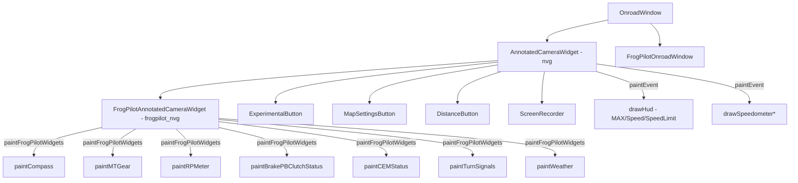
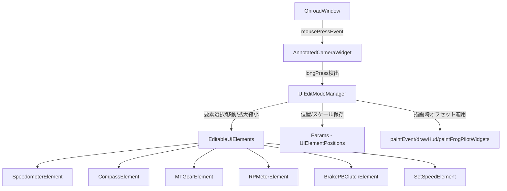
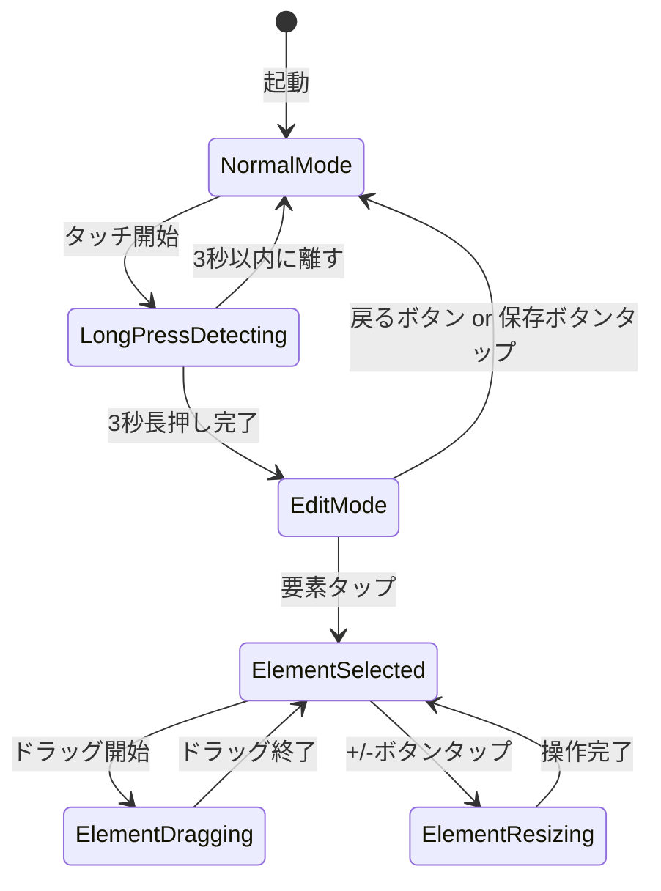

# FrogPilot UI編集モード アーキテクチャ設計書

## 1. アーキテクチャ概要

### 1.1 現在の構造



### 1.2 編集モード追加後の構造



### 1.3 状態遷移



## 2. 編集可能UI要素の特定

### 2.1 要素一覧と現在の描画位置

| 要素ID | 名称 | 描画関数 | 現在の位置計算 | ファイル |
|--------|------|---------|--------------|---------|
| `Speedometer` | スピードメーター | [`drawSpeedometer()`](selfdrive/ui/qt/onroad/annotated_camera.cc:285) | `rect().center().x(), 210` またはスタイル別固定位置 | `annotated_camera.cc` |
| `SetSpeed` | MAX速度 | [`drawHud()`](selfdrive/ui/qt/onroad/annotated_camera.cc:129) | `QPoint(60, 45)` ベース | `annotated_camera.cc` |
| `SpeedLimit` | 速度制限 | [`drawHud()`](selfdrive/ui/qt/onroad/annotated_camera.cc:129) | `set_speed_rect` からの相対 | `annotated_camera.cc` |
| `Compass` | コンパス | [`paintCompass()`](frogpilot/ui/qt/onroad/frogpilot_annotated_camera.cc:409) | `rightHandDM` に基づく動的計算 | `frogpilot_annotated_camera.cc` |
| `MTGear` | MTギア表示 | [`paintMTGear()`](frogpilot/ui/qt/onroad/frogpilot_annotated_camera.cc:1008) | `width()/2 - 100, 350` | `frogpilot_annotated_camera.cc` |
| `RPMeter` | RPMメーター | [`paintRPMeter()`](frogpilot/ui/qt/onroad/frogpilot_annotated_camera.cc:1087) | `width()/2, height()-120` | `frogpilot_annotated_camera.cc` |
| `BrakePBClutch` | ブレーキ/PB/クラッチ | [`paintBrakePBClutchStatus()`](frogpilot/ui/qt/onroad/frogpilot_annotated_camera.cc:1028) | `width()/2 - 120, 560` | `frogpilot_annotated_camera.cc` |

### 2.2 各要素のバウンディングボックス

各要素の描画時に計算される`QRect`をキャッシュし、編集モードでヒットテストに使用する：

```
Speedometer (Default): QRect(center.x()-100, 130, 200, 200)
Speedometer (F1LED):   QRect(panelX, panelY, panelW, panelH)
Speedometer (GT7):     QRect(centerX-radius-20, centerY-radius-20, radius*2+40, radius*2+40)
SetSpeed:              set_speed_rect (QRect)
Compass:               QRect(compassPosition, QSize(widget_size, widget_size))
MTGear:                QRect(width()/2-100, 350, 200, 200)
RPMeter:               QRect(centerX-radius, centerY-radius, radius*2, radius*2)
BrakePBClutch:         QRect(startX, startY, totalWidth, 60)
```

## 3. 詳細設計

### 3.1 新規クラス: `UIEditModeManager`

新規ファイル [`frogpilot/ui/qt/onroad/ui_edit_mode.h`](frogpilot/ui/qt/onroad/ui_edit_mode.h) に配置。

```cpp
// 編集可能なUI要素の定義
enum class EditableElement {
  None = 0,
  Speedometer,
  SetSpeed,
  SpeedLimit,
  Compass,
  MTGear,
  RPMeter,
  BrakePBClutch
};

// 各要素のオフセット・スケール設定
struct ElementConfig {
  int offset_x = 0;      // デフォルト位置からのXオフセット
  int offset_y = 0;      // デフォルト位置からのYオフセット  
  float scale = 1.0f;    // スケール倍率
  bool visible = true;   // 表示/非表示
};

class UIEditModeManager : public QObject {
  Q_OBJECT
public:
  explicit UIEditModeManager(QObject *parent = nullptr);
  
  // 状態管理
  bool isEditMode() const;
  void enterEditMode();
  void exitEditMode(bool save = true);
  
  // タッチイベント処理（AnnotatedCameraWidgetから委譲）
  bool handleMousePress(QMouseEvent *event, const QSize &widget_size);
  bool handleMouseMove(QMouseEvent *event, const QSize &widget_size);
  bool handleMouseRelease(QMouseEvent *event);
  
  // 要素のバウンディングボックス登録（描画時に呼び出す）
  void registerElementRect(EditableElement element, const QRect &rect);
  
  // 要素設定の取得
  ElementConfig getElementConfig(EditableElement element) const;
  
  // 描画オーバーレイ（編集モード時の枠線等）
  void paintEditModeOverlay(QPainter &p);
  
  // 設定の永続化
  void loadFromParams();
  void saveToParams();
  void resetToDefaults();
  
signals:
  void editModeChanged(bool editing);
  void elementSelected(EditableElement element);
  void configChanged();
  
private:
  bool edit_mode_ = false;
  EditableElement selected_element_ = EditableElement::None;
  EditableElement dragging_element_ = EditableElement::None;
  
  QMap<EditableElement, ElementConfig> configs_;
  QMap<EditableElement, QRect> element_rects_;
  
  // 長押し検出
  QElapsedTimer press_timer_;
  QPoint press_start_pos_;
  bool long_press_detected_ = false;
  static constexpr int LONG_PRESS_MS = 3000;
  
  // ドラッグ状態
  QPoint drag_last_pos_;
  
  // スケール操作用
  static constexpr float SCALE_STEP = 0.1f;
  static constexpr float SCALE_MIN = 0.3f;
  static constexpr float SCALE_MAX = 3.0f;
  
  Params params_;
};
```

### 3.2 長押し検出の実装

[`AnnotatedCameraWidget`](selfdrive/ui/qt/onroad/annotated_camera.h:13) に以下を追加：

```cpp
// annotated_camera.h に追加
protected:
  void mousePressEvent(QMouseEvent *event) override;
  void mouseMoveEvent(QMouseEvent *event) override;
  void mouseReleaseEvent(QMouseEvent *event) override;

private:
  UIEditModeManager *edit_mode_manager_;
```

長押し検出フロー：
1. `mousePressEvent` でタイマー開始、位置記録
2. `mouseReleaseEvent` でタイマー確認
   - 3秒以上経過 → `edit_mode_manager_->enterEditMode()`
   - 3秒未満 → 通常のタップ処理（既存の動作）
3. 編集モード中は `edit_mode_manager_` がイベントを消費

### 3.3 編集モード中の視覚フィードバック

[`paintEvent()`](selfdrive/ui/qt/onroad/annotated_camera.cc:1011) の最後でオーバーレイ描画：

```
編集モードON時:
┌─────────────────────────────────────────┐
│  [EDIT MODE]              [SAVE] [EXIT] │ ← ヘッダーバー
│                                         │
│     ┌──────────┐                        │
│     │  128     │  ← 選択中: 破線枠     │
│     │  km/h    │     ハンドルで緑枠     │
│     └──────────┘                        │
│                                         │
│  [-] [+]  ← スケールボタン              │
│                                         │
│  ┌────┐                                 │
│  │ N  │  ← 未選択: 薄い破線枠          │
│  └────┘                                 │
└─────────────────────────────────────────┘
```

オーバーレイ描画内容：
- **ヘッダーバー**: 「EDIT MODE」テキスト + SAVE/EXITボタン
- **選択中要素**: 緑色の破線枠 + 要素名ラベル
- **未選択要素**: 白色の薄い破線枠
- **スケールボタン**: 選択中要素の近くに [-] [+] 表示

### 3.4 描画関数へのオフセット適用

各描画関数の最初で `ElementConfig` を取得し、QPainterの変換を適用：

```cpp
// 例: drawSpeedometerDefault の変更
void AnnotatedCameraWidget::drawSpeedometerDefault(QPainter &p, ...) {
  ElementConfig config = edit_mode_manager_->getElementConfig(EditableElement::Speedometer);
  
  p.save();
  // デフォルト位置を計算
  int defaultX = rect().center().x();
  int defaultY = 210;
  // オフセット適用
  p.translate(config.offset_x, config.offset_y);
  if (config.scale != 1.0f) {
    p.translate(defaultX, defaultY);
    p.scale(config.scale, config.scale);
    p.translate(-defaultX, -defaultY);
  }
  
  // 既存の描画コード...
  p.setFont(InterFont(176, QFont::Bold));
  drawText(p, defaultX, defaultY, speed_str);
  // ...
  
  // バウンディングボックスを登録
  QRect bounds(defaultX - 100, defaultY - 80, 200, 200);
  edit_mode_manager_->registerElementRect(EditableElement::Speedometer, bounds);
  
  p.restore();
}
```

### 3.5 FrogPilotAnnotatedCameraWidget の変更点

[`FrogPilotAnnotatedCameraWidget`](frogpilot/ui/qt/onroad/frogpilot_annotated_camera.h:11) は現在 `Qt::WA_TransparentForMouseEvents` が設定されている。編集モードでは以下の対応をとる：

- **マウスイベントは引き続き `AnnotatedCameraWidget` で処理**（`FrogPilotAnnotatedCameraWidget` は透明のまま）
- `AnnotatedCameraWidget` が `edit_mode_manager_` を持ち、全要素のバウンディングボックスを管理
- `FrogPilotAnnotatedCameraWidget` の各 `paint*` 関数には `ElementConfig` を適用するためのオフセット渡しを追加

```cpp
// frogpilot_annotated_camera.h に追加
void setEditModeManager(UIEditModeManager *manager);

private:
  UIEditModeManager *edit_mode_manager_ = nullptr;
```

各 `paint*` 関数のシグネチャ変更は不要。代わりに、関数内で `edit_mode_manager_->getElementConfig()` を呼び出してオフセットを適用する。

## 4. Paramsキーの一覧

### 4.1 JSON形式で一括保存

単一のParamsキー `UIElementPositions` にJSON形式で全要素の設定を保存：

```json
{
  "Speedometer": { "offset_x": 0, "offset_y": 50, "scale": 1.2, "visible": true },
  "SetSpeed": { "offset_x": 0, "offset_y": 0, "scale": 1.0, "visible": true },
  "SpeedLimit": { "offset_x": 0, "offset_y": 0, "scale": 1.0, "visible": true },
  "Compass": { "offset_x": -30, "offset_y": 0, "scale": 1.0, "visible": true },
  "MTGear": { "offset_x": 100, "offset_y": -50, "scale": 1.5, "visible": true },
  "RPMeter": { "offset_x": 0, "offset_y": 0, "scale": 1.0, "visible": true },
  "BrakePBClutch": { "offset_x": 0, "offset_y": 0, "scale": 1.0, "visible": true }
}
```

### 4.2 新規Paramsキー

| キー名 | 型 | 用途 | 保存先 |
|--------|-----|------|--------|
| `UIElementPositions` | JSON string | 全要素のオフセット・スケール設定 | Params - 永続 |

### 4.3 frogpilot_variables.py への追加

[`frogpilot_default_params`](frogpilot/common/frogpilot_variables.py:156) に以下を追加：

```python
("UIElementPositions", "{}", 2, "{}"),
```

## 5. 変更ファイル一覧

### 5.1 新規ファイル

| ファイル | 内容 |
|---------|------|
| `frogpilot/ui/qt/onroad/ui_edit_mode.h` | `UIEditModeManager` クラス宣言、`EditableElement` enum、`ElementConfig` struct |
| `frogpilot/ui/qt/onroad/ui_edit_mode.cc` | `UIEditModeManager` の実装（長押し検出、ドラッグ、スケール、Params保存） |

### 5.2 変更ファイル

| ファイル | 変更内容 |
|---------|---------|
| [`selfdrive/ui/qt/onroad/annotated_camera.h`](selfdrive/ui/qt/onroad/annotated_camera.h) | `mousePressEvent/MoveEvent/ReleaseEvent` オーバーライド追加、`UIEditModeManager *edit_mode_manager_` メンバ追加 |
| [`selfdrive/ui/qt/onroad/annotated_camera.cc`](selfdrive/ui/qt/onroad/annotated_camera.cc) | コンストラクタで `edit_mode_manager_` 初期化、`paintEvent()` でオーバーレイ描画、`drawSpeedometer*()` 系でオフセット適用、`drawHud()` でSetSpeed/SpeedLimitのオフセット適用、マウスイベント3関数の実装 |
| [`frogpilot/ui/qt/onroad/frogpilot_annotated_camera.h`](frogpilot/ui/qt/onroad/frogpilot_annotated_camera.h) | `setEditModeManager()` 追加、`UIEditModeManager *edit_mode_manager_` メンバ追加 |
| [`frogpilot/ui/qt/onroad/frogpilot_annotated_camera.cc`](frogpilot/ui/qt/onroad/frogpilot_annotated_camera.cc) | `paintCompass()`, `paintMTGear()`, `paintRPMeter()`, `paintBrakePBClutchStatus()` でオフセット適用とバウンディングボックス登録 |
| [`frogpilot/common/frogpilot_variables.py`](frogpilot/common/frogpilot_variables.py) | `UIElementPositions` のデフォルトparams追加 |
| `selfdrive/ui/qt/onroad/SConscript` または該当ビルドファイル | 新規 `.cc` ファイルをビルドに追加 |

## 6. 実装ステップ

### Step 1: UIEditModeManager クラスの作成
- `frogpilot/ui/qt/onroad/ui_edit_mode.h` 作成
- `frogpilot/ui/qt/onroad/ui_edit_mode.cc` 作成
- 基本機能：状態管理、Params読み書き、要素のバウンディングボックス管理

### Step 2: AnnotatedCameraWidget へのマウスイベント追加
- `annotated_camera.h` に `mousePressEvent/MoveEvent/ReleaseEvent` 宣言追加
- `annotated_camera.cc` にマウスイベント実装
- コンストラクタで `edit_mode_manager_` を初期化
- 長押し3秒検出ロジックの実装

### Step 3: 編集モードのオーバーレイ描画
- `paintEvent()` の末尾で `edit_mode_manager_->paintEditModeOverlay(p)` 呼び出し追加
- ヘッダーバー（EDIT MODE表示、SAVE/EXITボタン）
- 各要素の枠線描画（選択中は緑、未選択は白破線）
- スケールボタン（+/-）の描画

### Step 4: drawSpeedometer系へのオフセット適用
- `drawSpeedometerDefault()`, `drawSpeedometerF1LED()`, `drawSpeedometerGT7()`, `drawSpeedometerForza()`, `drawSpeedometerNFS()`, `drawSpeedometerSimHub()` の各関数で：
  - `ElementConfig` 取得
  - `QPainter::translate()` / `QPainter::scale()` 適用
  - バウンディングボックス登録

### Step 5: drawHud のSetSpeed/SpeedLimitへのオフセット適用
- `drawHud()` 内の `set_speed_rect` 計算部分でオフセット適用
- SpeedLimit描画部分でオフセット適用

### Step 6: FrogPilotAnnotatedCameraWidget へのオフセット適用
- `setEditModeManager()` メソッド追加
- `paintCompass()`: `compassPosition` にオフセット適用
- `paintMTGear()`: `gearRect` にオフセット適用
- `paintRPMeter()`: `centerX/centerY` にオフセット適用
- `paintBrakePBClutchStatus()`: `startX/startY` にオフセット適用
- 各関数でバウンディングボックス登録

### Step 7: ドラッグによる要素移動の実装
- `mouseMoveEvent` で選択要素の `offset_x/offset_y` を更新
- `update()` で再描画

### Step 8: スケール変更の実装
- 編集モードUIの +/- ボタンによるスケール変更
- `SCALE_STEP = 0.1f` 刻みで `SCALE_MIN = 0.3f` ～ `SCALE_MAX = 3.0f` の範囲

### Step 9: 設定の永続化
- `saveToParams()`: JSON形式で `UIElementPositions` に保存
- `loadFromParams()`: 起動時に読み込み
- リセット機能の実装

### Step 10: ビルド設定の更新
- `SConscript` または該当ビルドファイルに `ui_edit_mode.cc` を追加

### Step 11: frogpilot_variables.py の更新
- `UIElementPositions` のデフォルト値 `{}` を追加

## 7. 懸念事項とリスク

### 7.1 パフォーマンス
- **リスク**: 編集モードのオーバーレイ描画が毎フレームの `paintEvent` に追加される
- **対策**: `isEditMode()` チェックは軽量（bool比較）なので、通常モードでのオーバーヘッドは最小。オーバーレイ描画は `if (edit_mode_manager_->isEditMode())` でガード

### 7.2 既存のタッチ操作との競合
- **リスク**: `OnroadWindow::mousePressEvent()` が既にマップ表示切り替え等に使用されている
- **対策**: 編集モード中は `AnnotatedCameraWidget` がイベントを消費（`event->accept()`）し、親への伝播を停止。`OnroadWindow` には届かない

### 7.3 スピードメータースタイルごとの位置計算の違い
- **リスク**: Style 0～5 で描画位置の計算方法が大きく異なる（中央、右下、左下など）
- **対策**: 各スタイルの `drawSpeedometer*()` 関数内で、デフォルト位置を基準にオフセットを適用。バウンディングボックスも各スタイルで個別に計算

### 7.4 画面解像度の違い
- **リスク**: 異なるデバイス（EON, comma 3X等）で解像度が異なる
- **対策**: オフセットはピクセル単位で保存するが、デフォルト位置は `width()/height()` から計算されているため、相対的な移動は自然に追従する。将来的には比率ベースの保存も検討

### 7.5 FrogPilotAnnotatedCameraWidget のマウスイベント透過
- **リスク**: `frogpilot_nvg` は `WA_TransparentForMouseEvents` が設定されており、直接マウスイベントを受け取れない
- **対策**: 全てのマウスイベント処理を `AnnotatedCameraWidget` 側で行う。`frogpilot_nvg` の各要素のバウンディングボックスは `AnnotatedCameraWidget` の座標系で管理（`frogpilot_nvg` は `setGeometry(rect())` で同じサイズに設定されているため座標系は同一）

### 7.6 スケール適用時のフォントサイズ
- **リスク**: `QPainter::scale()` を使うとフォントも拡大され、テキストがぼやける可能性がある
- **対策**: スケール適用時はフォントサイズを直接変更するアプローチも検討。ただし、初版では `QPainter::scale()` を使用し、品質問題があればフォントサイズ調整に切り替え

### 7.7 走行中の安全性
- **リスク**: 走行中に誤って編集モードに入る可能性
- **対策**: 
  - 3秒長押しは意図的な操作が必要であり、誤操作のリスクは低い
  - 編集モード中は半透明のオーバーレイが表示され、通常運転に影響があることを視覚的に通知
  - 将来的には速度しきい値（例: 5km/h以上では編集モード無効）の設定も検討

## 8. 今後の拡張可能性

- **ピンチズーム**: マルチタッチ対応の `touchEvent()` でピンチジェスチャによるスケール変更
- **要素の非表示**: `ElementConfig.visible` で個別要素の表示/非表示切り替え
- **プリセット保存**: 複数のレイアウトプリセットを保存・切り替え
- **設定画面からの調整**: FrogPilot設定画面にUI編集のリセットボタンを追加