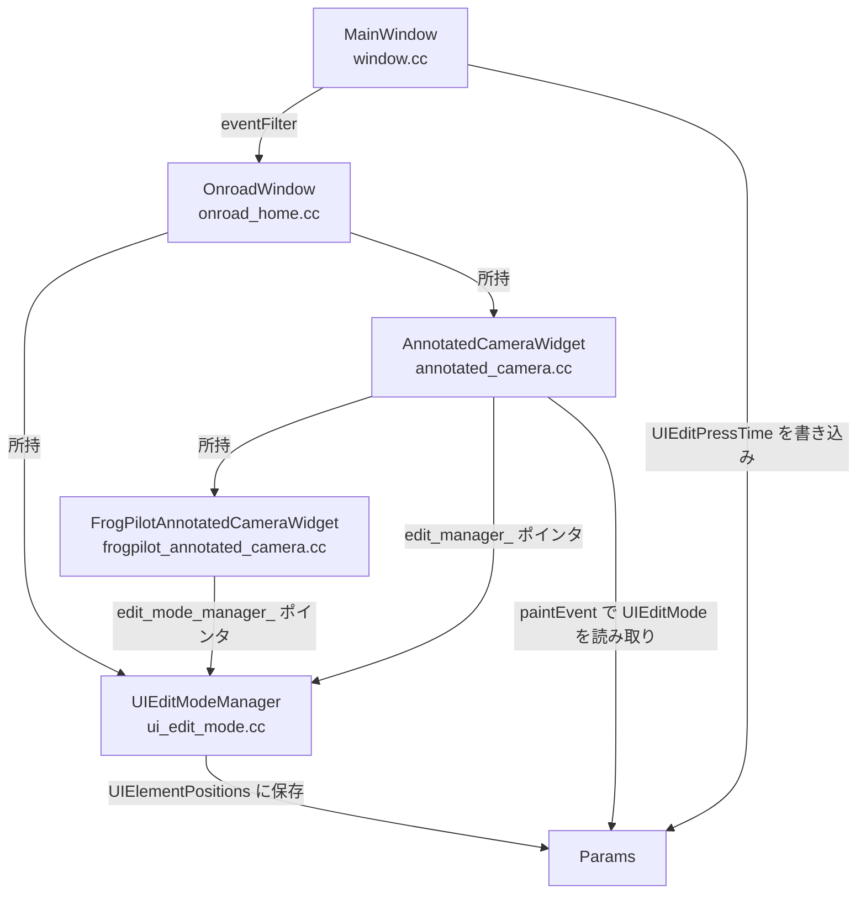
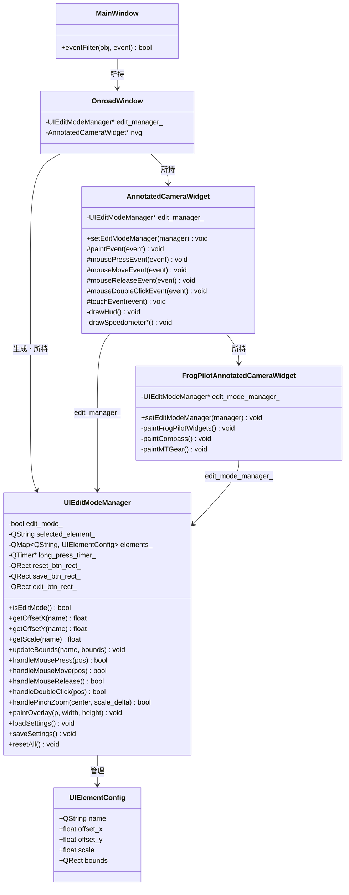
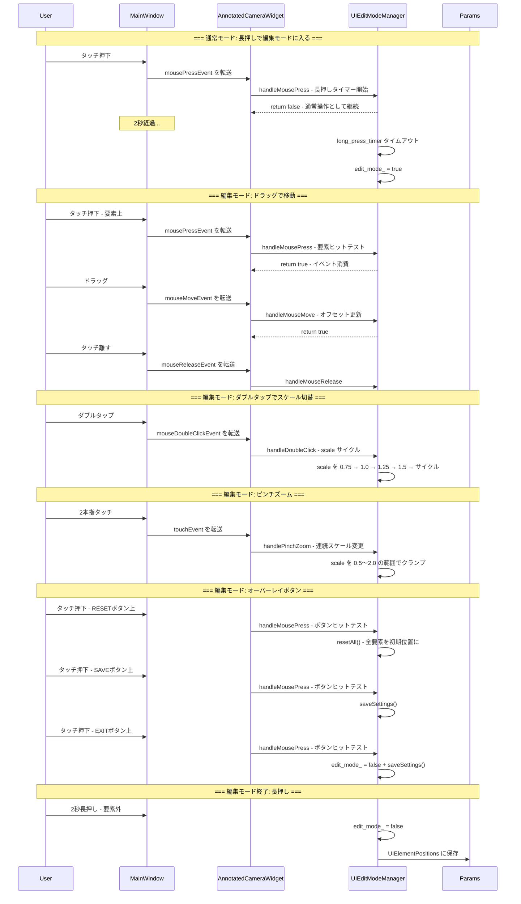
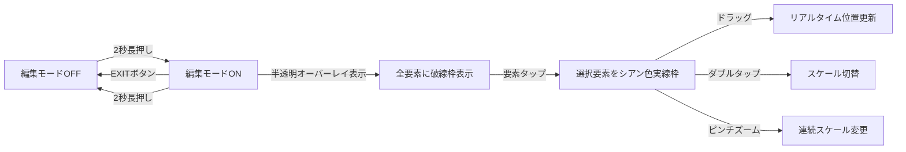
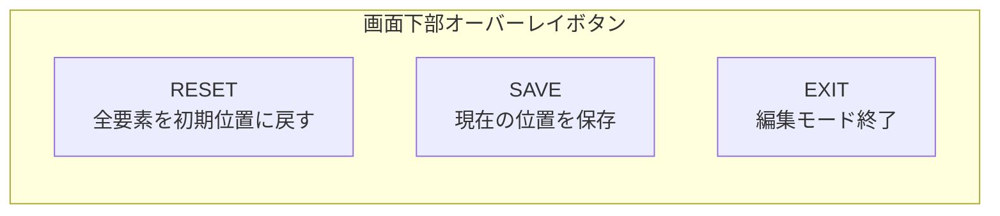

# UI編集モード 設計ドキュメント

## 1. 現在のアーキテクチャ分析

### 1.1 関連ファイルマップ



### 1.2 現在の問題点

| 問題 | 詳細 |
|------|------|
| **タッチイベント未接続** | `UIEditModeManager::handleMousePress/Move/Release()` が定義済みだが、どこからも呼ばれていない |
| **オーバーレイ二重描画** | `UIEditModeManager::paintOverlay()` と `paintEvent()` 内のインライン描画が両方存在 |
| **長押し検出が複雑** | `MainWindow::eventFilter()` → Params書き込み → `paintEvent()` でポーリングという迂回経路 |
| **スケール操作なし** | ダブルタップ・ピンチズームの機能が未実装 |

### 1.3 登録済み要素

| 要素名 | 登録場所 | 描画場所 |
|--------|----------|----------|
| `speedometer` | `ui_edit_mode.cc` コンストラクタ | `annotated_camera.cc` の各 `drawSpeedometer*()` |
| `max_speed` | 同上 | `annotated_camera.cc` の `drawHud()` |
| `compass` | 同上 | `frogpilot_annotated_camera.cc` の `paintCompass()` |
| `gear` | 同上 | `frogpilot_annotated_camera.cc` の `paintMTGear()` |
| `speed_limit` | 同上 | `annotated_camera.cc` の `drawHud()` |

---

## 2. 新アーキテクチャ設計

### 2.1 クラス図



### 2.2 タッチイベントフロー（新設計）



### 2.3 長押し検出の簡略化

**現在の問題**: `MainWindow::eventFilter()` が `UIEditPressTime` を Params に書き込み、`AnnotatedCameraWidget::paintEvent()` が ~20Hz でポーリングしてチェックするという複雑な仕組み。

**新設計**: `UIEditModeManager` の `QTimer` ベースの長押し検出を直接使用する。タッチイベントを `AnnotatedCameraWidget` にルーティングし、そこから `UIEditModeManager` に渡す。

### 2.4 描画オフセットの適用パターン

各描画関数でのオフセット適用は現在のパターンを踏襲:

```cpp
// 各描画関数のパターン（変更なし）
float ox = edit_manager_->getOffsetX("speedometer");
float oy = edit_manager_->getOffsetY("speedometer");
float sc = edit_manager_->getScale("speedometer");
p.save();
p.translate(ox, oy);
if (sc != 1.0f) p.scale(sc, sc);
// ... 描画処理 ...
edit_manager_->updateBounds("speedometer", QRect(...).translated(ox, oy));
p.restore();
```

---

## 3. Params キー設計

### 3.1 既存キー

| キー | 型 | 用途 |
|------|------|------|
| `UIEditMode` | bool | 編集モードのON/OFF状態 |
| `UIEditPressTime` | string(int64) | 押下時刻のタイムスタンプ |
| `UIElementPositions` | JSON | 要素の位置・スケール情報 |

### 3.2 UIElementPositions のJSON形式

```json
{
  "speedometer": { "x": 0, "y": 50, "s": 1.0 },
  "max_speed": { "x": -20, "y": 30, "s": 1.0 },
  "compass": { "x": 0, "y": 0, "s": 1.25 },
  "gear": { "x": 100, "y": -50, "s": 1.0 },
  "speed_limit": { "x": 0, "y": 0, "s": 1.0 }
}
```

| フィールド | 型 | 説明 |
|-----------|------|------|
| `x` | float | デフォルト位置からのXオフセット (px) |
| `y` | float | デフォルト位置からのYオフセット (px) |
| `s` | float | スケール倍率 (0.5〜2.0) |

### 3.3 廃止予定キー

| キー | 理由 |
|------|------|
| `UIEditPressTime` | タイマーベースの長押し検出に変更により不要 |

---

## 4. 操作方法の設計

### 4.1 編集モードへの入り方

| 操作 | アクション |
|------|-----------|
| 画面の空き領域を2秒長押し | 編集モードON/OFF切替 |

### 4.2 編集モード中の操作

| 操作 | アクション |
|------|-----------|
| 要素をタップしてドラッグ | 要素の移動 |
| 要素をダブルタップ | スケール切替 (0.75→1.0→1.25→1.5→サイクル) |
| 要素上でピンチイン/アウト | スケールの連続変更 (0.5〜2.0) |
| 空き領域を2秒長押し | 編集モード終了＋保存 |

### 4.3 視覚フィードバック



#### オーバーレイ描画内容

1. **半透明黒オーバーレイ** - `rgba(0, 0, 0, 40)` を画面全体に
2. **ヘッダーテキスト** - "UI EDIT MODE - Drag/pinch to move & resize, long press to exit"
3. **各要素の境界矩形** - 破線の白い枠線 (選択時はシアン色の実線)
4. **要素名ラベル** - 各矩形の上に要素名
5. **選択要素情報** - オフセット値・スケール値の表示

#### オーバーレイボタン（画面下部に配置）



| ボタン | 位置 | アクション |
|--------|------|-----------|
| **RESET** | 画面下部左 | 全要素のoffset_x/offset_y/scaleを0/0/1.0にリセット |
| **SAVE** | 画面下部中央 | 現在の位置・スケールをParamsに保存 |
| **EXIT** | 画面下部右 | 保存して編集モード終了 |

- ボタンサイズ: 180x60px、角丸24px
- 背景色: `rgba(0, 0, 0, 180)`、境界色: 白
- タップ判定は `paintOverlay()` 内でボタンのQRectを登録し、`handleMousePress()` で判定

---

## 5. 実装ステップ

### ステップ1: AnnotatedCameraWidget にマウスイベントハンドラを追加

**ファイル**: `selfdrive/ui/qt/onroad/annotated_camera.h`, `annotated_camera.cc`

- `mousePressEvent()`, `mouseMoveEvent()`, `mouseReleaseEvent()`, `mouseDoubleClickEvent()` をオーバーライド
- 各ハンドラで `edit_manager_->handleMouse*()` を呼び出し
- イベントが消費された場合は親に伝播しない
- `setAttribute(Qt::WA_AcceptTouchEvents)` を有効化

### ステップ2: UIEditModeManager の長押し検出を修正

**ファイル**: `frogpilot/ui/qt/onroad/ui_edit_mode.cc`

- `handleMousePress()` で長押しタイマーを開始
- `handleMouseMove()` で移動閾値超過時にタイマーをキャンセル
- `handleMouseRelease()` でタイマーを停止
- タイマー発火時に `edit_mode_` をトグル
- 編集モード終了時に `saveSettings()` を呼び出し

### ステップ3: ダブルタップ＋ピンチズームによるスケール変更を追加

**ファイル**: `frogpilot/ui/qt/onroad/ui_edit_mode.h`, `ui_edit_mode.cc`

- `handleDoubleClick(const QPoint &pos)` メソッドを追加
  - ヒットテストで要素を特定
  - scale を 0.75 → 1.0 → 1.25 → 1.5 のサイクルで切替
- `handlePinchZoom(const QPoint &center, float scale_delta)` メソッドを追加
  - マルチタッチの2点間距離変化からscale_deltaを計算
  - 選択中の要素のscaleを連続的に変更 (0.5〜2.0の範囲でクランプ)
  - ピンチ中心点を基準にオフセットも調整

**ファイル**: `selfdrive/ui/qt/onroad/annotated_camera.h`, `annotated_camera.cc`

- `touchEvent(QTouchEvent *event)` をオーバーライド
- タッチポイント数が2の場合:
  - 2点間の距離を追跡
  - 距離変化を `edit_manager_->handlePinchZoom()` に渡す
- `setAttribute(Qt::WA_AcceptTouchEvents)` を有効化

### ステップ4: オーバーレイにボタンを追加

**ファイル**: `frogpilot/ui/qt/onroad/ui_edit_mode.h`, `ui_edit_mode.cc`

- `paintOverlay()` にRESET/SAVE/EXITボタンの描画を追加
- ボタンのQRectをメンバー変数に保持（ヒットテスト用）
- `handleMousePress()` でボタンタップを判定:
  - RESET: `resetAll()` を呼び出し
  - SAVE: `saveSettings()` を呼び出し
  - EXIT: `edit_mode_ = false` + `saveSettings()`
- ボタンタップ時は長押しタイマーをキャンセル

### ステップ5: paintEvent のオーバーレイを統合

**ファイル**: `selfdrive/ui/qt/onroad/annotated_camera.cc`

- `paintEvent()` 内のインラインオーバーレイ描画を削除
- `edit_manager_->paintOverlay()` を呼び出すよう変更
- `paintEvent()` 内の Params ポーリング長押しチェックを削除

### ステップ6: MainWindow::eventFilter を簡略化

**ファイル**: `selfdrive/ui/qt/window.cc`, `window.h`

- `UIEditPressTime` への Params 書き込みを削除
- 編集モード関連のメンバー変数 (`edit_press_time_`, `edit_mode_`, `edit_press_pending_`) を削除
- タッチイベントを通常通り子ウィジェットに伝播させる

### ステップ7: FrogPilotAnnotatedCameraWidget のイベント転送

**ファイル**: `frogpilot/ui/qt/onroad/frogpilot_annotated_camera.cc`

- `setAttribute(Qt::WA_TransparentForMouseEvents)` は変更なし（マウスイベントは親のACWが処理）
- `paintFrogPilotWidgets()` 内の各描画でオフセット・スケール適用を確認

### ステップ8: 境界外ガードとスナップ

**ファイル**: `frogpilot/ui/qt/onroad/ui_edit_mode.cc`

- `handleMouseMove()` で要素が画面外に出ないよう制約を追加
- スケール変更時に最小/最大値 (0.5〜2.0) をクランプ

### ステップ9: テスト・デバッグ

- 各スピードメータースタイル (Default, F1LED, GT7, Forza, NFS, SimHub) で移動・スケールが正しく動作するか確認
- コンパス・ギア表示の移動を確認
- ピンチズームが正しく動作するか確認
- オーバーレイボタン (RESET/SAVE/EXIT) が正しく動作するか確認
- Params に保存された値が次回起動時に正しく復元されるか確認
- デバッグログ (`/tmp/ui_edit_debug.log`) のクリーンアップ

---

## 6. 変更ファイル一覧

| ファイル | 変更内容 |
|----------|----------|
| `frogpilot/ui/qt/onroad/ui_edit_mode.h` | `handleDoubleClick()`, `handlePinchZoom()` 追加、オーバーレイボタン用QRectメンバー追加 |
| `frogpilot/ui/qt/onroad/ui_edit_mode.cc` | 長押し検出の修正、ダブルタップ処理、ピンチズーム処理、オーバーレイボタン描画・判定、境界ガード追加 |
| `selfdrive/ui/qt/onroad/annotated_camera.h` | マウスイベント + touchEvent のオーバーライド宣言追加 |
| `selfdrive/ui/qt/onroad/annotated_camera.cc` | マウスイベント実装、touchEvent実装（ピンチズーム）、paintEventオーバーレイ統合 |
| `selfdrive/ui/qt/window.cc` | eventFilter の簡略化、UIEditPressTime削除 |
| `selfdrive/ui/qt/window.h` | 編集モード関連メンバー削除 |

**変更なし**（動作確認のみ）:
- `selfdrive/ui/qt/onroad/onroad_home.h/.cc`
- `frogpilot/ui/qt/onroad/frogpilot_annotated_camera.h/.cc`

---

## 7. リスクと対策

| リスク | 対策 |
|--------|------|
| タッチイベントが子ウィジェットに伝播しない | `WA_TransparentForMouseEvents` の設定を確認し、必要に応じて `event->ignore()` を適切に使用 |
| スピードメーターのスタイルごとにbounds計算が異なる | 各 `drawSpeedometer*()` 内の `updateBounds()` 呼び出しですでに対応済み |
| スケール変更時にテキストが見切れる | bounds更新をスケール反映後のサイズで行うよう修正 |
| 運転中に誤って編集モードに入る | 2秒の長押し閾値を維持し、移動検出でキャンセル |
| ピンチズームとドラッグの競合 | タッチポイント数でモードを切替（1点=ドラッグ、2点=ピンチ） |
| オーバーレイボタンが他のUI要素と重なる | ボタンは画面下部に配置し、編集モード中のみ表示 |